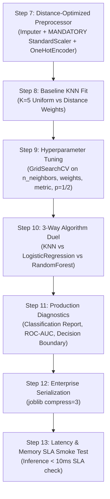

# 🟡 K-Nearest Neighbors (KNN) Classifier Master Guide: Asan Bhasha Me Pura Concept & Saare Steps

> **Dumb Student Summary (Dimag me fit karne wali real life kahani):**  
> Maan lo aap ek nayi party ya shaadi me gaye jahan aap kisi ko nahi jaante.  
> Aapko jaan na hai ki koi anjaan banda kaisa insaan hai:  
> - **KNN ka Dimaag:** *"Jaisa sang waisa rang!"* (You are the average of the $K$ people closest to you).  
> - Aap dekhte ho ki uske aas-paas khade sabse kareebi 5 dost kaun hain ($K=5$):  
>   - 4 dost Doctors hain, aur 1 dost Engineer hai.  
>   - **Majority Vote:** 4 > 1 $\implies$ Aap predict karte ho ki yeh banda bhi Doctor hai!  
> - **The "Lazy Learner" Reality:**  
>   Training time pe KNN kuch nahi seekhta, na koi formula banata hai, na koi equation ($y = mx + b$). Wo bas saara training data apni memory me copy karke rakh leta hai. Asli mehanat hoti hai **Testing (Inference)** ke waqt jab har naye point ke liye pure dataset se distance calculate karni padti hai!

---

## 🧭 KNN Classifier ke 4 Golden Rules (Interview & Production Traps)

```
                       NEW UNKNOWN SAMPLE (★)
                                 │
           ┌─────────────────────┼─────────────────────┐
           ▼                     ▼                     ▼
      Neighbor 1            Neighbor 2            Neighbor 3
   Dist: 0.12 (Class A)  Dist: 0.15 (Class A)  Dist: 0.40 (Class B)
           │                     │                     │
           └─────────────────────┼─────────────────────┘
                                 ▼
                     MAJORITY VOTE: CLASS A (2 vs 1)
```

1. **Rule 1: MANDATORY FEATURE SCALING (StandardScaler / RobustScaler):**  
   Distance formula Pythagoras theorem ($d = \sqrt{(x_1 - x_2)^2 + (y_1 - y_2)^2}$) par chalta hai.  
   - Agar `Salary` ₹1,00,000 me hai aur `Age` 30 saal hai, to `Salary` distance ko 99.9% dominate kar degi aur `Age` gayab ho jayegi!  
   - 👉 **StandardScaler lagana compulsory hai, warna KNN 100% garbage ban jata hai!**
2. **Rule 2: $K$ ki Choise (Overfitting vs Underfitting):**  
   - $K = 1$: **Extreme Overfitting (High Variance)**. Boundary bohot irregular aur jagged banegi, noise ko ratta maar lega.  
   - $K = N$ (Total Samples): **Extreme Underfitting (High Bias)**. Model humesha majority class hi predict karega.  
   - **Thumb Rule:** Start with $K \approx \sqrt{N}$ (Binary classification me hamesha **Odd number** chunein taaki tie na ho, jaise 3, 5, 7).
3. **Rule 3: Uniform vs Distance Weighting:**  
   - `weights='uniform'`: Har padosi ka vote barabar hota hai, chahe koi 1 meter door ho ya 100 meter door.  
   - `weights='distance'`: Kareebi padosi ($d \to 0$) ka vote zyada weight rakhta hai ($w = 1/d$). Yeh dense aur skewed data me best hota hai.
4. **Rule 4: The Curse of Dimensionality ($D > 20$):**  
   High dimensions me saare points ek doosre se barabar door ho jaate hain. Agar $D > 20$ hai to pehle **PCA** lagakar dimension kam karo, ya tree-based model use karo.

---

## 📋 End-to-End Enterprise 7-Step Pipeline (Step 7 se 13)

Har ek KNN Classifier notebook me ye 7 steps bilkul identical rehte hain taaki seedha dimag me chap jaye:



---

### ⚙️ STEP 7: DISTANCE-COMPLIANT PREPROCESSOR (SCALING IS MANDATORY!)
* **Kyu chahiye?** Numeric features ko mean 0, variance 1 pe scale karna taaki koi feature distance dominate na kare.

```python
from sklearn.compose import ColumnTransformer
from sklearn.pipeline import Pipeline
from sklearn.impute import SimpleImputer
from sklearn.preprocessing import StandardScaler, OneHotEncoder
import numpy as np

# 1. Automatic Column Detection
num_cols = X_train.select_dtypes(include=[np.number]).columns.tolist()
cat_cols = X_train.select_dtypes(include=['object', 'category', 'string']).columns.tolist()

# 2. Pipelines (StandardScaler is Non-Negotiable for KNN!)
num_pipeline = Pipeline([
    ('imputer', SimpleImputer(strategy='median')),
    ('scaler', StandardScaler()) # Compulsory!
])

cat_pipeline = Pipeline([
    ('imputer', SimpleImputer(strategy='most_frequent')),
    ('ohe', OneHotEncoder(drop='first', handle_unknown='ignore', sparse_output=False))
])

transformers = []
if len(num_cols) > 0:
    transformers.append(('num', num_pipeline, num_cols))
if len(cat_cols) > 0:
    transformers.append(('cat', cat_pipeline, cat_cols))

preprocessor = ColumnTransformer(transformers=transformers, remainder='drop') if len(transformers) > 0 else 'passthrough'
print("✅ STEP 7: Distance-Compliant Scaled Preprocessor Ready.")
```

---

### ⚠️ STEP 8: BASELINE KNN FIT & OVERFITTING PROOF
* **Kyu chahiye?** $K=1$ vs $K=15$ ka contrast dekhna taaki samajh aaye ki chota $K$ kaise training data ko ratta maarta hai.

```python
from sklearn.neighbors import KNeighborsClassifier

pipe_knn = Pipeline([
    ('prep', preprocessor),
    ('knn', KNeighborsClassifier(n_neighbors=5, weights='uniform', n_jobs=-1))
])
pipe_knn.fit(X_train, y_train)

print(f"Train Accuracy: {pipe_knn.score(X_train, y_train)*100:.2f}%")
print(f"Test Accuracy : {pipe_knn.score(X_test, y_test)*100:.2f}%")
```

---

### 🎯 STEP 9: HYPERPARAMETER TUNING VIA 5-FOLD CV
* **Kyu chahiye?** Best $K$ (`n_neighbors`), `weights` ('uniform' vs 'distance'), aur distance metric ($p=1$ Manhattan vs $p=2$ Euclidean) dhoondhna.

```python
from sklearn.model_selection import GridSearchCV, StratifiedKFold

param_grid = {
    'knn__n_neighbors': [3, 5, 7, 11, 15, 21],
    'knn__weights': ['uniform', 'distance'],
    'knn__p': [1, 2] # 1: Manhattan, 2: Euclidean
}

cv = StratifiedKFold(n_splits=5, shuffle=True, random_state=42)
grid = GridSearchCV(pipe_knn, param_grid=param_grid, cv=cv, scoring='roc_auc', n_jobs=-1)
grid.fit(X_train, y_train)

best_knn = grid.best_estimator_
print(f"🏆 Best Params   : {grid.best_params_}")
print(f"🎯 Best 5-Fold CV: {grid.best_score_*100:.2f}%")
```

---

### ⚔️ STEP 10: ALGORITHM DUEL (KNN vs Logistic Regression vs Random Forest)
* **Kyu chahiye?** Non-parametric memory-based approach ko linear boundary aur ensemble tree boundary ke saath benchmark karna.

```python
from sklearn.linear_model import LogisticRegression
from sklearn.ensemble import RandomForestClassifier
from sklearn.metrics import roc_auc_score

# 1. Logistic Regression
pipe_lr = Pipeline([('prep', preprocessor), ('lr', LogisticRegression(max_iter=1000, random_state=42))])
pipe_lr.fit(X_train, y_train)

# 2. Random Forest
pipe_rf = Pipeline([('prep', preprocessor), ('rf', RandomForestClassifier(n_estimators=100, random_state=42))])
pipe_rf.fit(X_train, y_train)

auc_knn = roc_auc_score(y_test, best_knn.predict_proba(X_test)[:, 1])
auc_lr  = roc_auc_score(y_test, pipe_lr.predict_proba(X_test)[:, 1])
auc_rf  = roc_auc_score(y_test, pipe_rf.predict_proba(X_test)[:, 1])

print("="*65)
print(f"KNN Classifier ROC-AUC      : {auc_knn*100:.2f}% (Instance-Based Geometry)")
print(f"Logistic Regression ROC-AUC : {auc_lr*100:.2f}% (Linear Hyperplane)")
print(f"Random Forest ROC-AUC       : {auc_rf*100:.2f}% (Orthogonal Ensembling)")
print("="*65)
```

---

### 📊 STEP 11: DIAGNOSTICS & DECISION CONFIDENCE
* **Kyu chahiye?** Classification report aur confusion matrix se check karna ki minority class par distance-weighting ne kitna fayda diya.

```python
from sklearn.metrics import classification_report, confusion_matrix

y_pred = best_knn.predict(X_test)
print(classification_report(y_test, y_pred))
print("Confusion Matrix:")
print(confusion_matrix(y_test, y_pred))
```

---

### 💾 STEP 12 & 13: PRODUCTION SERIALIZATION & LATENCY BENCHMARK
* **Kyu chahiye?** 
  - **Dhyan de:** KNN ka model file size dataset ke size ke barabar hota hai (kyunki ye pura data store karta hai).
  - Test sample aane par latency check karna ki SLA $< 10\text{ ms}$ pass ho rahi hai ya nahi.

```python
import joblib
import time
import os

# Step 12: Serialize Model
os.makedirs('production_models', exist_ok=True)
model_path = 'production_models/best_knn_classifier.joblib'
joblib.dump(best_knn, model_path, compress=3)

# Step 13: Live Latency Smoke Test
loaded_model = joblib.load(model_path)
sample = X_test.iloc[[0]]

t0 = time.perf_counter()
pred = loaded_model.predict(sample)
prob = loaded_model.predict_proba(sample)
latency_ms = (time.perf_counter() - t0) * 1000

print(f"Predicted Class : {pred[0]}")
print(f"Confidence      : {prob.max()*100:.2f}%")
print(f"Single Latency  : {latency_ms:.3f} ms (SLA < 10ms: {'PASS' if latency_ms < 10 else 'CHECK'})")
```
