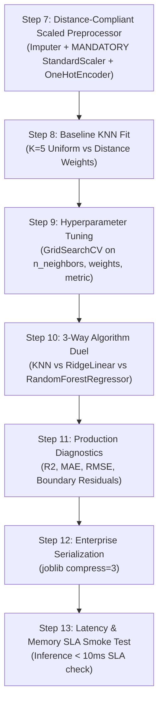

# 🟡 K-Nearest Neighbors (KNN) Regressor Master Guide: Asan Bhasha Me Pura Concept & Saare Steps

> **Dumb Student Summary (Dimag me fit karne wali real life kahani):**  
> Maan lo aapko ek 3-BHK flat ki rent ya price pata karni hai:  
> - **Real Estate Agent ka Dimaag (KNN Regressor):**  
>   *"Bhai, is flat ke 500 meter ke daayre me jo 5 flats pichhle hafte rent par chadhe hain ($K=5$), unka rent dekho!"*  
>   - Flat 1: ₹30,000  
>   - Flat 2: ₹32,000  
>   - Flat 3: ₹31,000  
>   - Flat 4: ₹35,000  
>   - Flat 5: ₹32,000  
> - **Final Rent Prediction:** In 5 padosiyon ka **Average (Local Mean)** = ₹32,000!  
> - **Distance Weighted Twist:** Jo flat aapke flat ke theek bagal me hai (distance $\approx 0$), uski rent ka asar zyada hoga, aur jo 2 gali chhod kar hai uska asar kam hoga!  
>   $$\hat{y} = \frac{\sum_{i=1}^K w_i y_i}{\sum_{i=1}^K w_i} \quad \text{where } w_i = \frac{1}{d_i}$$

---

## 🧭 KNN Regressor ke 4 Critical Rules (Interview & Production Traps)

```
                       NEW HOUSE QUERY (★)
                                │
          ┌─────────────────────┼─────────────────────┐
          ▼                     ▼                     ▼
     House 1 (100m)        House 2 (250m)        House 3 (900m)
      Price: $300k          Price: $320k          Price: $280k
     Weight: High          Weight: Medium         Weight: Low
          │                     │                     │
          └─────────────────────┼─────────────────────┘
                                ▼
         DISTANCE-WEIGHTED AVERAGE PREDICTION = $306,500
```

1. **Rule 1: MANDATORY FEATURE SCALING (StandardScaler):**  
   Agar `SquareFootage` (1000 - 5000) ko bina scale kiye `Bedrooms` (1 - 5) ke saath daal diya, to distance me `Bedrooms` ka koi vajood nahi bachega. **Scaler is 100% compulsory!**
2. **Rule 2: ⚠️ The Extrapolation Disaster (KNN Ki Sabse Badi Kamzori!):**  
   KNN kabhi bhi training data ke minimum aur maximum target values ke bahar predict nahi kar sakta:  
   $$\min(y_{\text{train}}) \le \hat{y} \le \max(y_{\text{train}})$$  
   *Real life disaster:* Agar training data me sabse bada ghar 5,000 sq ft ka tha (\$1M), aur test me 20,000 sq ft ka Antilia-style mansion aa gaya, tab bhi KNN uski price maximum \$1M hi bata sakta hai! Isliye trend prediction ya stock market extrapolation ke liye KNN bilkul bekaar hai.
3. **Rule 3: Uniform vs Distance-Weighted Surfaces:**  
   - `weights='uniform'`: Stepped/staircase prediction graph deta hai (jagged).  
   - `weights='distance'`: Smooth, continuous regression curve banata hai jo practical use ke liye bohot behtar hota hai.
4. **Rule 4: Inverted Bias-Variance vs Parametric Models:**  
   - $K=1$: Training $R^2 = 1.0$ (High Variance, pure noise ratta).  
   - $K=N$: Hamesha training data ka overall mean $\bar{y}$ predict karega ($R^2 \to 0$, High Bias).

---

## 📋 End-to-End Enterprise 7-Step Pipeline (Step 7 se 13)

Har ek KNN Regressor notebook me ye 7 steps bilkul identical rehte hain taaki seedha dimag me chap jaye:



---

### ⚙️ STEP 7: DISTANCE-COMPLIANT PREPROCESSOR (SCALING IS MANDATORY!)
* **Kyu chahiye?** Sare numeric features ko unit variance me lana taaki Euclidean distance un-biased rahe.

```python
from sklearn.compose import ColumnTransformer
from sklearn.pipeline import Pipeline
from sklearn.impute import SimpleImputer
from sklearn.preprocessing import StandardScaler, OneHotEncoder
import numpy as np

num_cols = X_train.select_dtypes(include=[np.number]).columns.tolist()
cat_cols = X_train.select_dtypes(include=['object', 'category', 'string']).columns.tolist()

num_pipeline = Pipeline([
    ('imputer', SimpleImputer(strategy='median')),
    ('scaler', StandardScaler()) # Mandatory for Distance Calculations!
])

cat_pipeline = Pipeline([
    ('imputer', SimpleImputer(strategy='most_frequent')),
    ('ohe', OneHotEncoder(drop='first', handle_unknown='ignore', sparse_output=False))
])

transformers = []
if len(num_cols) > 0:
    transformers.append(('num', num_pipeline, num_cols))
if len(cat_cols) > 0:
    transformers.append(('cat', cat_pipeline, cat_cols))

preprocessor = ColumnTransformer(transformers=transformers, remainder='drop') if len(transformers) > 0 else 'passthrough'
print("✅ STEP 7: Scaled Preprocessor Ready.")
```

---

### ⚠️ STEP 8: BASELINE KNN REGRESSOR FIT & OVERFITTING PROOF
* **Kyu chahiye?** Check karna ki $K=5$ par train aur test $R^2$ me kitna gap hai.

```python
from sklearn.neighbors import KNeighborsRegressor
from sklearn.metrics import r2_score

pipe_knn = Pipeline([
    ('prep', preprocessor),
    ('knn', KNeighborsRegressor(n_neighbors=5, weights='distance', n_jobs=-1))
])
pipe_knn.fit(X_train, y_train)

train_r2 = r2_score(y_train, pipe_knn.predict(X_train))
test_r2  = r2_score(y_test, pipe_knn.predict(X_test))

print(f"Train R² Score: {train_r2*100:.2f}%")
print(f"Test R² Score : {test_r2*100:.2f}%")
```

---

### 🎯 STEP 9: HYPERPARAMETER TUNING VIA 5-FOLD CV
* **Kyu chahiye?** Best $K$, `weights` ('distance' vs 'uniform'), aur metric ($p=1$ vs $p=2$) dhoondhna.

```python
from sklearn.model_selection import GridSearchCV, KFold

param_grid = {
    'knn__n_neighbors': [3, 5, 7, 10, 15, 20],
    'knn__weights': ['uniform', 'distance'],
    'knn__p': [1, 2]
}

cv = KFold(n_splits=5, shuffle=True, random_state=42)
grid = GridSearchCV(pipe_knn, param_grid=param_grid, cv=cv, scoring='r2', n_jobs=-1)
grid.fit(X_train, y_train)

best_knn = grid.best_estimator_
print(f"🏆 Best Hyperparameters: {grid.best_params_}")
print(f"🎯 Best 5-Fold CV R²   : {grid.best_score_*100:.2f}%")
```

---

### ⚔️ STEP 10: ALGORITHM DUEL (KNN vs Ridge vs Random Forest)
* **Kyu chahiye?** Prove karna ki distance-based local averaging vs linear slope vs decision trees me kaun sa approach is continuous target par jeet-ta hai.

```python
from sklearn.linear_model import Ridge
from sklearn.ensemble import RandomForestRegressor

# 1. Ridge Linear Model
pipe_ridge = Pipeline([('prep', preprocessor), ('ridge', Ridge())])
pipe_ridge.fit(X_train, y_train)

# 2. Random Forest Regressor
pipe_rf = Pipeline([('prep', preprocessor), ('rf', RandomForestRegressor(n_estimators=100, random_state=42, n_jobs=-1))])
pipe_rf.fit(X_train, y_train)

r2_knn   = r2_score(y_test, best_knn.predict(X_test))
r2_ridge = r2_score(y_test, pipe_ridge.predict(X_test))
r2_rf    = r2_score(y_test, pipe_rf.predict(X_test))

print("="*65)
print(f"KNN Regressor R²       : {r2_knn*100:.2f}% (Instance Local Averaging)")
print(f"Ridge Linear Model R²  : {r2_ridge*100:.2f}% (Global Linear Hyperplane)")
print(f"Random Forest Model R² : {r2_rf*100:.2f}% (Ensemble Orthogonal Splits)")
print("="*65)
```

---

### 📊 STEP 11: RESIDUAL DIAGNOSTICS & BOUNDARY CHECK
* **Kyu chahiye?** Check karna ki boundary par error kitna badh raha hai (edge effect) aur MAE/RMSE kitna hai.

```python
from sklearn.metrics import mean_absolute_error, root_mean_squared_error

y_pred = best_knn.predict(X_test)
residuals = y_test - y_pred

mae = mean_absolute_error(y_test, y_pred)
rmse = root_mean_squared_error(y_test, y_pred)

print(f"Mean Absolute Error (MAE): {mae:.4f}")
print(f"Root Mean Squared Error  : {rmse:.4f}")
print(f"Mean Residual Error      : {residuals.mean():.4f}")
```

---

### 💾 STEP 12 & 13: PRODUCTION SERIALIZATION & LATENCY SMOKE TEST
* **Kyu chahiye?** Model artifact save karna aur single-sample inference latency SLA (< 10ms) verify karna.

```python
import joblib
import time
import os

# Step 12: Atomic Serialization
os.makedirs('production_models', exist_ok=True)
model_path = 'production_models/best_knn_regressor.joblib'
joblib.dump(best_knn, model_path, compress=3)

# Step 13: Live Latency Smoke Test
loaded_model = joblib.load(model_path)
sample = X_test.iloc[[0]]

t0 = time.perf_counter()
pred = loaded_model.predict(sample)
latency_ms = (time.perf_counter() - t0) * 1000

print(f"Predicted Value : {pred[0]:.4f}")
print(f"Single Latency  : {latency_ms:.3f} ms (SLA < 10ms: {'PASS' if latency_ms < 10 else 'CHECK'})")
```
