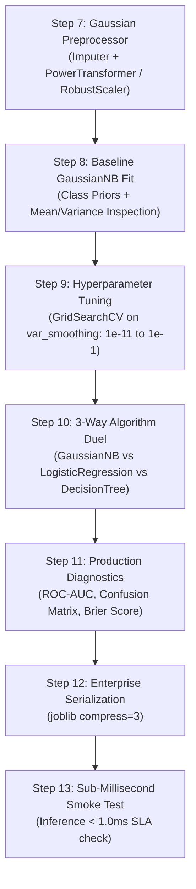

# 🔔 Gaussian Naive Bayes Master Guide: Asan Bhasha Me Pura Concept & Saare Steps

> **Dumb Student Summary (Dimag me fit karne wali real life kahani):**  
> Maan lo aap ek doctor ke paas gaye aur bola: *"Mera BP 140 hai aur Sugar 210 hai, kya mujhe diabetes hai?"*  
> - **Doctor ka dimaag (Bayes Rule):**  
>   1. Pehle se kitne % logo ko diabetes hota hai? (Prior Probability: $P(Y)$)  
>   2. Jin logo ko diabetes hota hai, unka BP aur Sugar aamtaur par kaisa (Bell Curve / Normal Distribution) dikhta hai? ($P(X|Y)$)  
> - **"Naive" Kyu Kehte Hain?**  
>   Ye man-ghadant assumption leta hai ki **BP aur Sugar ka aapas me koi lena-dena nahi hai** (Conditional Independence). Real life me dono related hote hain, par Naive Bayes unhe independent maankar dono ki probabilities ko seedha multiply kar deta hai:  
>   $$P(Y|X) \propto P(Y) \times P(\text{BP}|Y) \times P(\text{Sugar}|Y)$$  
> - **"Gaussian" Kyu?**  
>   Kyunki continuous numerical features (jaise Blood Pressure, Age, Glucose) ko ye assume karta hai ki wo **Bell Curve (Gaussian / Normal Distribution)** follow karte hain:  
>   $$P(x_i | y) = \frac{1}{\sqrt{2\pi\sigma_y^2}} \exp\left(-\frac{(x_i - \mu_y)^2}{2\sigma_y^2}\right)$$

---

## 🧭 Gaussian NB ke 3 Critical Rules (Interview & Production Traps)

1. **Rule 1: Continuous Numerical Data Only:**  
   Gaussian NB sirf continuous real-valued numbers ke liye bana hai (jaise Sensor readings, Medical stats, Physical measurements). Text ya binary data ke liye yeh galat choice hai.
2. **Rule 2: Bell Curve (Gaussian Assumption) & PowerTransformer:**  
   Agar data heavily skewed (tedha-medha) hai, to Gaussian NB fail ho sakta hai. Isliye `PowerTransformer(method='yeo-johnson')` lagakar data ko bell-curve me transform karna best practice hota hai!
3. **Rule 3: `var_smoothing` Guard (Zero Division Protection):**  
   Agar kisi class me kisi feature ka variance $\sigma^2 \to 0$ ho jaye (saari values same ho jayein), to division by zero ho sakta hai. Scikit-learn ka `var_smoothing=1e-9` parameter is variance me ek chota sa constant add karke model ko crash hone se bachata hai!

---

## 📋 End-to-End Enterprise 7-Step Pipeline (Step 7 se 13)

Har ek Gaussian NB notebook me ye 7 steps bilkul identical rehte hain taaki seedha dimag me chap jaye:



---

### ⚙️ STEP 7: GAUSSIAN-OPTIMIZED PREPROCESSOR
* **Kyu chahiye?** Skewed continuous data ko Gaussian (Bell-shaped) banana aur missing values impute karna.

```python
from sklearn.compose import ColumnTransformer
from sklearn.pipeline import Pipeline
from sklearn.impute import SimpleImputer
from sklearn.preprocessing import PowerTransformer
import numpy as np

num_cols = X_train.select_dtypes(include=[np.number]).columns.tolist()

num_pipeline = Pipeline([
    ('imputer', SimpleImputer(strategy='median')),
    ('yeo_johnson', PowerTransformer(method='yeo-johnson')) # Data ko Normal/Gaussian banata hai
])

preprocessor = ColumnTransformer(
    transformers=[('num', num_pipeline, num_cols)],
    remainder='drop'
)
print("✅ STEP 7: Gaussian-Optimized Preprocessor Ready.")
```

---

### ⚠️ STEP 8: BASELINE GAUSSIAN NB FIT & PRIORS INSPECTION
* **Kyu chahiye?** Default baseline fit karke check karna ki classes ke prior probabilities ($P(Y)$) aur class means ($\mu$) kya hain.

```python
from sklearn.naive_bayes import GaussianNB

pipe_gnb = Pipeline([
    ('prep', preprocessor),
    ('gnb', GaussianNB())
])
pipe_gnb.fit(X_train, y_train)

# Priors inspection:
gnb_model = pipe_gnb.named_steps['gnb']
print(f"Class Priors P(Y): {gnb_model.class_prior_}")
print(f"Baseline Train Accuracy: {pipe_gnb.score(X_train, y_train)*100:.2f}%")
print(f"Baseline Test Accuracy : {pipe_gnb.score(X_test, y_test)*100:.2f}%")
```

---

### 🎯 STEP 9: HYPERPARAMETER TUNING (`var_smoothing`)
* **Kyu chahiye?** `var_smoothing` sabse important parameter hai. Ye feature variance ka kitna fraction add karega taaki probability curve smooth rahe.

```python
from sklearn.model_selection import GridSearchCV, StratifiedKFold

param_grid = {
    'gnb__var_smoothing': np.logspace(-11, -1, 100)
}

cv = StratifiedKFold(n_splits=5, shuffle=True, random_state=42)
grid = GridSearchCV(pipe_gnb, param_grid=param_grid, cv=cv, scoring='roc_auc', n_jobs=-1)
grid.fit(X_train, y_train)

best_gnb = grid.best_estimator_
print(f"🏆 Best var_smoothing : {grid.best_params_['gnb__var_smoothing']:.2e}")
print(f"🎯 Best 5-Fold ROC-AUC: {grid.best_score_*100:.2f}%")
```

---

### ⚔️ STEP 10: ALGORITHM DUEL (GaussianNB vs Logistic Regression vs DecisionTree)
* **Kyu chahiye?** Compare karna ki linear baseline aur tree baseline ke mukable probabilistic approach kaisa perform karti hai.

```python
from sklearn.linear_model import LogisticRegression
from sklearn.tree import DecisionTreeClassifier
from sklearn.metrics import roc_auc_score

# 1. Logistic Regression Pipeline
pipe_lr = Pipeline([('prep', preprocessor), ('lr', LogisticRegression(max_iter=1000, random_state=42))])
pipe_lr.fit(X_train, y_train)

# 2. Decision Tree Pipeline
pipe_dt = Pipeline([('prep', preprocessor), ('dt', DecisionTreeClassifier(max_depth=5, random_state=42))])
pipe_dt.fit(X_train, y_train)

# Benchmarking
auc_gnb = roc_auc_score(y_test, best_gnb.predict_proba(X_test)[:, 1])
auc_lr  = roc_auc_score(y_test, pipe_lr.predict_proba(X_test)[:, 1])
auc_dt  = roc_auc_score(y_test, pipe_dt.predict_proba(X_test)[:, 1])

print("="*65)
print(f"Gaussian Naive Bayes ROC-AUC: {auc_gnb*100:.2f}% (Ultra-Fast Probabilistic)")
print(f"Logistic Regression ROC-AUC : {auc_lr*100:.2f}% (Discriminative Linear)")
print(f"Decision Tree ROC-AUC       : {auc_dt*100:.2f}% (Non-linear Partitioning)")
print("="*65)
```

---

### 📊 STEP 11: PROBABILISTIC DIAGNOSTICS & CALIBRATION
* **Kyu chahiye?** Naive Bayes ki predicted probabilities extreme (0 ya 1 ke bohot paas) hoti hain kyunki independence assumption probabilities ko overconfident bana deta hai. Brier score se calibration quality check hoti hai.

```python
from sklearn.metrics import classification_report, brier_score_loss

y_pred = best_gnb.predict(X_test)
y_prob = best_gnb.predict_proba(X_test)[:, 1]

brier = brier_score_loss(y_test, y_prob)
print(classification_report(y_test, y_pred))
print(f"Brier Score Loss: {brier:.4f} (Closer to 0 = Well Calibrated)")
```

---

### 💾 STEP 12 & 13: PRODUCTION SERIALIZATION & SUB-MILLISECOND SMOKE TEST
* **Kyu chahiye?** Gaussian NB pure machine learning me sabse fast models me se ek hai (typically $< 0.15\text{ ms}$).

```python
import joblib
import time
import os

# Step 12: Serialize
os.makedirs('production_models', exist_ok=True)
model_path = 'production_models/best_gaussian_nb.joblib'
joblib.dump(best_gnb, model_path, compress=3)

# Step 13: Sub-Millisecond Smoke Test
loaded_model = joblib.load(model_path)
sample = X_test.iloc[[0]]

t0 = time.perf_counter()
pred = loaded_model.predict(sample)
prob = loaded_model.predict_proba(sample)
latency_ms = (time.perf_counter() - t0) * 1000

print(f"Predicted Class : {pred[0]}")
print(f"Confidence      : {prob.max()*100:.2f}%")
print(f"Latency         : {latency_ms:.3f} ms (SLA < 1.0ms: {'PASS' if latency_ms < 1.0 else 'CHECK'})")
```
