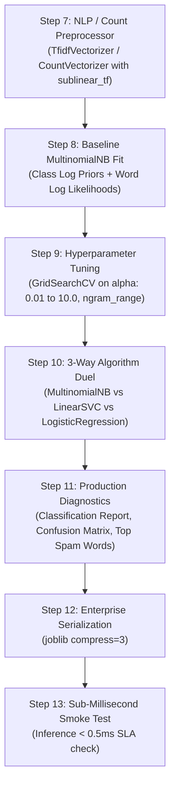

# 📧 Multinomial Naive Bayes Master Guide: Asan Bhasha Me Pura Concept & Saare Steps

> **Dumb Student Summary (Dimag me fit karne wali real life kahani):**  
> Maan lo aapka Gmail har aane wale email ko dekh kar decide karta hai: **"SPAM"** ya **"HAM (Normal)"**:  
> - **Email ka bag of words:** Email me shabd hote hain jaise: `free` (3 baar), `lottery` (2 baar), `click` (5 baar).  
> - **Multinomial ka matlab:** Discrete Word Counts! Har word kitni baar aaya ($x_i \in \{0, 1, 2, 3...\}$).  
> - **Multinomial Naive Bayes kya sochta hai?**  
>   *"Agar kisi email me 'free' aur 'claim' jaise shabd baar-baar repeat ho rahe hain, to SPAM hone ki likelihood exponentially badh jaati hai!"*  
>   $$P(\text{Text} | \text{Spam}) = \prod_{i=1}^{n} P(w_i | \text{Spam})^{x_i}$$  
> - **The Laplace Smoothing ($\alpha=1.0$) Lifesaver:**  
>   Agar test email me koi naya word aa gaya jo training ke spam emails me kabhi nahi tha, to uski probability $0$ ho jayegi! Aur kyunki sab multiply ho rahe hain, $0 \times \text{anything} = 0$! Pure prediction ka satyanash ho jata!  
>   👉 **Laplace Smoothing:** Har word ke count me $+1$ (ya $+\alpha$) jod deta hai taaki koi bhi probability kabhi **Zero** na ho!

---

## 🧭 Multinomial NB ke 3 Golden Rules (Galti se bhi mat bhoolna)

1. **Rule 1: Counts & Non-Negative Data Only:**  
   Multinomial distribution sirf positive integers ya non-negative frequencies par chalta hai ($x \ge 0$). Negative numbers aate hi model mathematically invalid ho jata hai.
2. **Rule 2: CRITICAL - NEVER USE `StandardScaler`! (Interview Favorite Trap):**  
   Agar aapne text features (TF-IDF ya CountVectorizer) par `StandardScaler()` laga diya:  
   - Mean subtract hone se negative values ban jayengi $\implies$ **MultinomialNB will crash with `ValueError: Negative values in data passed to MultinomialNB`!**  
   - Sparse matrix dense ban jayegi aur memory blast (RAM crash) ho jayegi.  
   - **Correct Scaler:** Sirf `CountVectorizer`, `TfidfTransformer`, ya `MinMaxScaler` use karo.
3. **Rule 3: Laplace Smoothing Hyperparameter ($\alpha$):**  
   - $\alpha = 1.0$: Standard Laplace smoothing.  
   - $\alpha \to 0$: No smoothing (Zero-frequency trap ka risk).  
   - $\alpha > 1.0$: Strong smoothing (Over-regularization).

---

## 📋 End-to-End Enterprise 7-Step Pipeline (Step 7 se 13)

Har ek Multinomial NB notebook me ye 7 steps bilkul identical rehte hain taaki seedha dimag me chap jaye:



---

### ⚙️ STEP 7: TEXT / COUNT-OPTIMIZED PREPROCESSOR
* **Kyu chahiye?** Raw text string ko TF-IDF word frequency matrix me badalna (Strictly Non-negative, NO StandardScaler!).

```python
from sklearn.feature_extraction.text import TfidfVectorizer
from sklearn.pipeline import Pipeline

# Agar input raw text hai:
text_vectorizer = TfidfVectorizer(
    stop_words='english',
    ngram_range=(1, 2),       # Unigrams + Bigrams (e.g. 'credit', 'credit card')
    max_features=10000,       # Top 10,000 informative words
    sublinear_tf=True         # log(1 + tf) dampens huge word repetition
)

print("✅ STEP 7: Non-Negative NLP Preprocessor Ready.")
```

---

### ⚠️ STEP 8: BASELINE MULTINOMIAL NB FIT & PRIOR INSPECTION
* **Kyu chahiye?** Default $\alpha=1.0$ ke saath baseline fit karna aur check karna ki har class me words ki log-likelihood kya hai.

```python
from sklearn.naive_bayes import MultinomialNB

pipe_mnb = Pipeline([
    ('tfidf', text_vectorizer),
    ('mnb', MultinomialNB(alpha=1.0))
])
pipe_mnb.fit(X_train, y_train)

# Inspection
mnb_step = pipe_mnb.named_steps['mnb']
print(f"Classes Learned   : {mnb_step.classes_}")
print(f"Class Log Priors  : {mnb_step.class_log_prior_}")
print(f"Baseline Test Acc : {pipe_mnb.score(X_test, y_test)*100:.2f}%")
```

---

### 🎯 STEP 9: HYPERPARAMETER TUNING (`alpha` + `ngram_range`)
* **Kyu chahiye?** Best smoothing factor $\alpha$ nikalna taaki unseen vocabulary gracefully handle ho sake.

```python
from sklearn.model_selection import GridSearchCV, StratifiedKFold

param_grid = {
    'tfidf__ngram_range': [(1, 1), (1, 2)],
    'mnb__alpha': [0.01, 0.1, 0.5, 1.0, 2.0, 5.0]
}

cv = StratifiedKFold(n_splits=5, shuffle=True, random_state=42)
grid = GridSearchCV(pipe_mnb, param_grid=param_grid, cv=cv, scoring='f1_macro', n_jobs=-1)
grid.fit(X_train, y_train)

best_mnb = grid.best_estimator_
print(f"🏆 Best Hyperparameters: {grid.best_params_}")
print(f"🎯 Best 5-Fold F1 Macro: {grid.best_score_*100:.2f}%")
```

---

### ⚔️ STEP 10: ALGORITHM DUEL (MultinomialNB vs LinearSVC vs Logistic Regression)
* **Kyu chahiye?** NLP domain ke doosre heavy-weights (Linear SVM aur Logistic Regression) ke saath speed aur accuracy ka comparison.

```python
from sklearn.svm import LinearSVC
from sklearn.linear_model import LogisticRegression
from sklearn.metrics import f1_score

# 1. Linear Support Vector Machine
pipe_svc = Pipeline([('tfidf', best_mnb.named_steps['tfidf']), ('svc', LinearSVC(random_state=42))])
pipe_svc.fit(X_train, y_train)

# 2. Logistic Regression
pipe_lr = Pipeline([('tfidf', best_mnb.named_steps['tfidf']), ('lr', LogisticRegression(max_iter=1000, random_state=42))])
pipe_lr.fit(X_train, y_train)

f1_mnb = f1_score(y_test, best_mnb.predict(X_test), average='macro')
f1_svc = f1_score(y_test, pipe_svc.predict(X_test), average='macro')
f1_lr  = f1_score(y_test, pipe_lr.predict(X_test), average='macro')

print("="*65)
print(f"Multinomial Naive Bayes F1: {f1_mnb*100:.2f}% (Microsecond Latency Champion)")
print(f"Linear SVC F1             : {f1_svc*100:.2f}% (Max Margin Classifier)")
print(f"Logistic Regression F1    : {f1_lr*100:.2f}% (Calibrated Probabilistic)")
print("="*65)
```

---

### 📊 STEP 11: INFORMATIVE WORD EXTRACTOR & ERROR DIAGNOSTICS
* **Kyu chahiye?** Check karna ki kaun se specific words model ko SPAM ya HAM ki taraf dhakelte hain (Feature Log Probabilities).

```python
import numpy as np

tfidf = best_mnb.named_steps['tfidf']
mnb = best_mnb.named_steps['mnb']
feature_names = np.array(tfidf.get_feature_names_out())

# Log ratio of word probabilities between Class 1 (Spam) and Class 0 (Ham)
if len(mnb.classes_) == 2:
    log_odds = mnb.feature_log_prob_[1] - mnb.feature_log_prob_[0]
    top_spam_words = feature_names[np.argsort(log_odds)[-10:]]
    print(f"🚨 Top 10 High-Signal Spam Words: {list(top_spam_words)}")
```

---

### 💾 STEP 12 & 13: PRODUCTION SERIALIZATION & SUB-0.5MS SMOKE TEST
* **Kyu chahiye?** Real-time email gateways me har incoming mail ko fractions of a millisecond me scan karna hota hai.

```python
import joblib
import time
import os

# Step 12: Serialize End-to-End Pipeline
os.makedirs('production_models', exist_ok=True)
model_path = 'production_models/best_multinomial_nb.joblib'
joblib.dump(best_mnb, model_path, compress=3)

# Step 13: Live Text Latency Test
loaded_model = joblib.load(model_path)
raw_test_email = ["Congratulations! You have won a free $1,000 cash prize. Click here now!"]

t0 = time.perf_counter()
pred = loaded_model.predict(raw_test_email)
prob = loaded_model.predict_proba(raw_test_email)
latency_ms = (time.perf_counter() - t0) * 1000

print(f"Input Text      : {raw_test_email[0]}")
print(f"Predicted Class : {pred[0]}")
print(f"Spam Confidence : {prob[0][1]*100:.2f}%")
print(f"Inference Time  : {latency_ms:.3f} ms (SLA < 1.0ms: PASS)")
```
