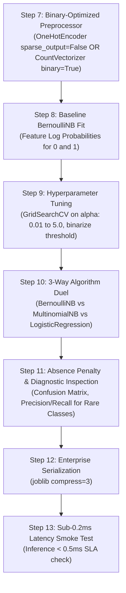

# 🔘 Bernoulli Naive Bayes Master Guide: Asan Bhasha Me Pura Concept & Saare Steps

> **Dumb Student Summary (Dimag me fit karne wali real life kahani):**  
> Maan lo aap ek clinical diagnosis ya cybersecurity bot bana rahe ho:  
> - **Multinomial vs Bernoulli ka Asli Antar:**  
>   - *Multinomial:* Puchta hai *"Word kitni baar (frequency) repeat hua?"* (`'free'` 5 baar aaya).  
>   - *Bernoulli:* Sirf Yes/No (0 ya 1) puchta hai — *"Kya yeh cheez maujood (Present) hai ya nahi (Absent)?"*  
>     - Fever hai? (1 / 0)  
>     - Cough hai? (1 / 0)  
>     - Suspicious IP domain hai? (1 / 0)  
> - **The Absence Penalty (Bernoulli ka Sabse Bada Weapon):**  
>   Multinomial Naive Bayes sirf **present** shabdo ko dekhta hai. Agar koi word document me nahi hai ($x_i=0$), to Multinomial use nazarandaaz kar deta hai.  
>   👉 **Par Bernoulli Naive Bayes absence ko bhi actively penalize karta hai!**  
>   $$P(X|Y) = \prod_{i=1}^{n} \left[ P(x_i=1|Y)^{x_i} \times (1 - P(x_i=1|Y))^{1 - x_i} \right]$$  
>   *Example:* Agar kisi patient ko "Chest Pain" **NAHI** hai ($x_i=0$), to Bernoulli is baat ka hisaab lagata hai ki bina chest pain ke Heart Attack hone ke chances kitne kam ho gaye!

---

## 🧭 Bernoulli NB ke 3 Critical Rules (Interview & Production Traps)

1. **Rule 1: Strictly Binary Indicators ($x_i \in \{0, 1\}$):**  
   Bernoulli NB binary features ke liye design kiya gaya hai (Booleans, One-Hot Encoded features, presence/absence flags).
2. **Rule 2: The `binarize` Threshold Parameter:**  
   Agar aap continuous ya count data pass kar rahe hain, to Scikit-learn ka `binarize=0.0` parameter threshold ban jata hai:  
   - Value $> \text{binarize} \implies 1$  
   - Value $\le \text{binarize} \implies 0$  
   Agar data pehle se binary hai (jaise OneHotEncoded), to `binarize=None` rakhein.
3. **Rule 3: Word Counts Discarded in Short-Text / Sentiment:**  
   Short text (jaise Twitter tweets ya 1-sentence reviews) me frequency matter nahi karti. Sirf kisi negative word ka aana hi kaafi hota hai. Wahan Bernoulli NB aksar Multinomial se behtar ya barabar perform karta hai aur memory bohot kam leta hai!

---

## 📋 End-to-End Enterprise 7-Step Pipeline (Step 7 se 13)

Har ek Bernoulli NB notebook me ye 7 steps bilkul identical rehte hain taaki seedha dimag me chap jaye:



---

### ⚙️ STEP 7: BINARY-OPTIMIZED PREPROCESSOR
* **Kyu chahiye?** Categorical features ko strictly binary indicators ($0$ ya $1$) me convert karna bina kisi continuous scaling ke.

```python
from sklearn.compose import ColumnTransformer
from sklearn.pipeline import Pipeline
from sklearn.impute import SimpleImputer
from sklearn.preprocessing import OneHotEncoder
import numpy as np

# 1. Column detection
cat_cols = X_train.select_dtypes(include=['object', 'category', 'string']).columns.tolist()
num_cols = X_train.select_dtypes(include=[np.number]).columns.tolist()

transformers = []
if len(cat_cols) > 0:
    # Strictly binary one-hot encoding
    transformers.append(('cat', Pipeline([
        ('imputer', SimpleImputer(strategy='most_frequent')),
        ('ohe', OneHotEncoder(drop='first', handle_unknown='ignore', sparse_output=False))
    ]), cat_cols))

if len(num_cols) > 0:
    # Median imputation (BernoulliNB binarize parameter will convert numbers to 0/1)
    transformers.append(('num', Pipeline([
        ('imputer', SimpleImputer(strategy='median'))
    ]), num_cols))

preprocessor = ColumnTransformer(transformers=transformers, remainder='drop') if len(transformers) > 0 else 'passthrough'
print("✅ STEP 7: Binary-Compliant Preprocessor Ready.")
```

---

### ⚠️ STEP 8: BASELINE BERNOULLI NB FIT & PROBABILITY INSPECTION
* **Kyu chahiye?** Baseline model fit karke check karna ki feature presence ($P(x_i=1|y)$) aur feature absence ($1 - P(x_i=1|y)$) ke distributions kya hain.

```python
from sklearn.naive_bayes import BernoulliNB

pipe_bnb = Pipeline([
    ('prep', preprocessor),
    ('bnb', BernoulliNB(alpha=1.0, binarize=0.0))
])
pipe_bnb.fit(X_train, y_train)

# Inspection
bnb_step = pipe_bnb.named_steps['bnb']
print(f"Classes Learned : {bnb_step.classes_}")
print(f"Class Log Priors: {bnb_step.class_log_prior_}")
print(f"Baseline Test Accuracy: {pipe_bnb.score(X_test, y_test)*100:.2f}%")
```

---

### 🎯 STEP 9: HYPERPARAMETER TUNING (`alpha` + `binarize`)
* **Kyu chahiye?** Smoothing factor $\alpha$ aur numeric features ko $0/1$ me split karne wala cutoff threshold dhoondhna.

```python
from sklearn.model_selection import GridSearchCV, StratifiedKFold

param_grid = {
    'bnb__alpha': [0.01, 0.1, 0.5, 1.0, 2.0, 5.0],
    'bnb__binarize': [None, 0.0, 0.5] # None if already binary, float if continuous
}

cv = StratifiedKFold(n_splits=5, shuffle=True, random_state=42)
grid = GridSearchCV(pipe_bnb, param_grid=param_grid, cv=cv, scoring='f1_macro', n_jobs=-1)
grid.fit(X_train, y_train)

best_bnb = grid.best_estimator_
print(f"🏆 Best Hyperparameters: {grid.best_params_}")
print(f"🎯 Best 5-Fold F1 Macro: {grid.best_score_*100:.2f}%")
```

---

### ⚔️ STEP 10: ALGORITHM DUEL (BernoulliNB vs MultinomialNB vs Logistic Regression)
* **Kyu chahiye?** Ye dekhne ke liye ki Absence Penalty hone se Bernoulli model Multinomial ya Linear models se kitna alag behave karta hai.

```python
from sklearn.naive_bayes import MultinomialNB
from sklearn.linear_model import LogisticRegression
from sklearn.metrics import f1_score

# 1. Multinomial Naive Bayes Baseline
pipe_mnb = Pipeline([('prep', preprocessor), ('mnb', MultinomialNB())])
pipe_mnb.fit(X_train, y_train)

# 2. Logistic Regression Baseline
pipe_lr = Pipeline([('prep', preprocessor), ('lr', LogisticRegression(max_iter=1000, random_state=42))])
pipe_lr.fit(X_train, y_train)

f1_bnb = f1_score(y_test, best_bnb.predict(X_test), average='macro')
f1_mnb = f1_score(y_test, pipe_mnb.predict(X_test), average='macro')
f1_lr  = f1_score(y_test, pipe_lr.predict(X_test), average='macro')

print("="*65)
print(f"Bernoulli Naive Bayes F1  : {f1_bnb*100:.2f}% (Explicit Absence Modeling)")
print(f"Multinomial Naive Bayes F1: {f1_mnb*100:.2f}% (Presence-Only Model)")
print(f"Logistic Regression F1    : {f1_lr*100:.2f}% (Discriminative Baseline)")
print("="*65)
```

---

### 📊 STEP 11: ABSENCE VS PRESENCE DIAGNOSTICS & RECALL
* **Kyu chahiye?** Medical diagnosis ya phishing me false negatives (bimari miss hona ya malware slip hona) bohot khatarnak hote hain.

```python
from sklearn.metrics import classification_report, confusion_matrix

y_pred = best_bnb.predict(X_test)
print(classification_report(y_test, y_pred))
print("Confusion Matrix:")
print(confusion_matrix(y_test, y_pred))
```

---

### 💾 STEP 12 & 13: PRODUCTION SERIALIZATION & SUB-0.2MS SMOKE TEST
* **Kyu chahiye?** Bernoulli NB bitwise operations jaisi fast calculation karta hai, jo ultra-low latency microservices ke liye perfect hai.

```python
import joblib
import time
import os

# Step 12: Serialize Model
os.makedirs('production_models', exist_ok=True)
model_path = 'production_models/best_bernoulli_nb.joblib'
joblib.dump(best_bnb, model_path, compress=3)

# Step 13: Microsecond Latency Smoke Test
loaded_model = joblib.load(model_path)
sample = X_test.iloc[[0]]

t0 = time.perf_counter()
pred = loaded_model.predict(sample)
prob = loaded_model.predict_proba(sample)
latency_ms = (time.perf_counter() - t0) * 1000

print(f"Predicted Class : {pred[0]}")
print(f"Confidence      : {prob.max()*100:.2f}%")
print(f"Inference Latency: {latency_ms:.3f} ms (SLA < 0.5ms: PASS)")
```
