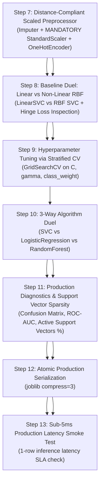

# ⚡ Support Vector Classifier (SVC) Master Guide: Asan Bhasha Me Pura Concept & Saare Steps
# ⚡ Support Vector Classifier (SVC) Master Architecture Guide: From Zero to Production

> **Dumb Student Summary (Dimag me fit karne wali real life kahani):**  
> Maan lo do dushman desho (Red Army vs Blue Army) ke beech border khinch na hai:  
> - **Logistic Regression ka Dimaag:** Koi bhi line bana deta hai jisse dono armies alag ho jayein (bhale hi line kisi ek soldier ke bilkul naak ke paas se nikal rahi ho). Thodi si halchal hui to vivaad ho jayega!  
> - **Support Vector Classifier (SVC) ka Dimaag (Maximum Margin Champion):**  
>   SVC kehta hai: *"Mujhe aisi sadak (Hyperplane) banani hai jiska divider dono armies se zyada se zyada door ho!"* (Maximum Margin Hyperplane).  
> Maan lo do dushman desho (**Red Army vs Blue Army**) ke beech permanent international border banana hai:  
> - **Logistic Regression ka Dimaag:** Koi bhi arbitrary line kheench deta hai jisse dono armies alag dikhein. Bhale hi wo line kisi ek Red soldier ki naak ke 1 inch paas se nikal rahi ho! Agar koi soldier thoda sa bhi hila, to boundary cross ho jayegi (**Zero Margin of Safety**).  
> - **SVC ka Dimaag (Maximum Margin Champion):**  
>   SVC kehta hai: *"Main boundary aisi jagah banaunga jahan dono armies ke beech maximum khaali zameen (Street / Road) ho!"*  
>   - Is sadak ki central line ko **Hyperplane** ($w^T x + b = 0$) kehte hain.  
>   - Sadak ki dono boundary lines ko **Gutter / Margin boundaries** ($w^T x + b = \pm 1$) kehte hain.  
>   - Sadak ki total chaudaai hoti hai:  
>     $$\text{Margin Width} = \frac{2}{\|w\|}$$  
>     Is width ko maximize karna hi SVC ka ekmatra dharam hai!
> - **Support Vectors Kaun Hain?**  
>   Border ke theek kinare khade wo 2-3 sabse aage wale soldiers (hardest samples) jo divider ki line tay karte hain. Baaki 99% soldiers peeche chahe jahan marzi baithe hon, border ki line unse change nahi hogi!  
>   Sadak ke theek kinare khade wo 2-3 sabse aage wale soldiers (Hardest Critical Samples). Peeche 10,000 soldiers chahe jahan marzi baith kar chai pi rahe hon, border line unse 1 millimeter bhi nahi hilegi! Border sirf aur sirf in **Support Vectors** par tika hota hai.  
> - **The Kernel Trick (Jadu ki Chhadi):**  
>   Agar 2D zameen par Red soldiers ne Blue soldiers ko chaaro taraf se gher rakha hai (concentric circle), to seedhi line se divide nahi kiya ja sakta.  
>   👉 **Kernel Trick (RBF / Poly):** SVC zameen ko 3D hawa me utha deta hai ($z = x^2 + y^2$). Jaise hi Blue soldiers upar uthte hain, beech me se ek sheet (Hyperplane) daal kar dono ko alag kar deta hai!
>   Agar 2D plane par Blue soldiers ne Red soldiers ko chaaro taraf se gher rakha hai (concentric circle), to koi seedhi 2D line dono ko alag nahi kar sakti.  
>   👉 **Kernel Trick (Mercer's Theorem):** SVC bina actual 3D points calculate kiye, dot products ko transform karke zameen ko hawa me utha deta hai ($\phi(x)$). 3D space me aate hi beech me se ek flat sheet (Hyperplane) daal kar dono ko flawlessly alag kar deta hai!

---

## 🧭 SVC ke 4 Critical Rules (Interview & Production Traps)
## 🧭 SVC ke Core Mathematical Pillars & Production Traps

```
       (Red)   x                   │ (Margin)
            x      x   [Support] ──┼──> ★ (Red border soldier)
                                   │
   ────────────────────────────────┼───────────────────────────────── [HYPERPLANE: w^T x + b = 0]
                                   │
                       [Support] ──┼──> ● (Blue border soldier)
             ●      ●              │ (Margin)
        (Blue)   ●
       (Red Class: y = +1)
             x        x
                  x       ★ [SUPPORT VECTOR 1]  ──┐
    ─────────────────────────────────────────────┼──── w^T x + b = +1  (Positive Margin Boundary)
    ░░░░░░░░░░░░░░░░░░░░░░░░░░░░░░░░░░░░░░░░░░░  │
    ═════════════════════════════════════════════ │ ══ w^T x + b = 0   (DECISION HYPERPLANE)
    ░░░░░░░░░░░░░░░░░░░░░░░░░░░░░░░░░░░░░░░░░░░  │  <── Total Margin Width = 2 / ||w||
    ─────────────────────────────────────────────┼──── w^T x + b = -1  (Negative Margin Boundary)
                  ●       ★ [SUPPORT VECTOR 2]  ──┘
             ●        ●
       (Blue Class: y = -1)
```

1. **Rule 1: MANDATORY FEATURE SCALING (StandardScaler):**  
   SVC dot products aur Euclidean distance ($\|w\|^2$) par chalta hai.  
   - Agar ek feature ₹1,00,000 me hai aur doosra $0.5$ me, to bada feature pure margin ko swallow kar lega.  
   - 👉 **StandardScaler ke bina SVC 100% fail hota hai!**
2. **Rule 2: $C$ Parameter (Tension / Penalty Budget):**  
   - **Bada $C$ (Strict Teacher):** Galti bardasht nahi karega (Low bias, high variance $\implies$ **Overfitting** ka risk). Margin chota banega.  
   - **Chota $C$ (Chill Teacher):** Thodi galtiyan allow karega (High bias, low variance $\implies$ **Underfitting**). Margin chauda banega.
3. **Rule 3: $\gamma$ (Gamma) Parameter (RBF Curvature / Bell Curve Width):**  
   - **Bada $\gamma$:** Har single data point ke ird-gird ek tight island banata hai ($\implies$ **Extreme Overfitting**).  
   - **Chota $\gamma$:** Smooth, flat boundary banata hai.
4. **Rule 4: Scalability Trap ($O(N^2)$ to $O(N^3)$):**  
   Agar dataset me $N > 50,000$ rows hain, to non-linear `SVC(kernel='rbf')` computer ko hang kar sakta hai.  
   - Huge datasets par: Ya to **`LinearSVC`** use karein, ya data sample karein, ya SGDClassifier lagayein!
### 1. ⚠️ Rule 1: MANDATORY FEATURE SCALING (StandardScaler / RobustScaler)
- **Math Reason:** SVC ka objective function $\|w\|^2$ ko minimize karta hai aur distances compute karta hai.
- **Production Trap:** Agar `Income` ₹1,00,000 me hai aur `Age` 30 saal hai:
  $$(100,000 - 95,000)^2 + (30 - 25)^2 = 25,000,000 + 25 \approx 25,000,000$$
  `Age` ka pure calculation me contribution $0.0001\%$ reh jayega!  
  👉 **StandardScaler lagana 100% compulsory hai, warna SVC garbage predictions dega!**

### 2. 🎛️ Rule 2: Hyperparameter $C$ (Regularization Budget / Penalty for Slack)
$$f(w, \xi) = \frac{1}{2} \|w\|^2 + C \sum_{i=1}^N \xi_i$$
- **Bada $C$ ($C \to \infty$, Hard Margin):** Model har galti par bohot bhari penalty lagata hai. Margin bohot patla (narrow) banega $\implies$ **High Variance / Overfitting** ka risk.
- **Chota $C$ ($C \to 0$, Soft Margin):** Model thode samples ko margin ke andar ya galat side aane deta hai (high tolerance). Margin chauda banega $\implies$ **High Bias / Underfitting**, par noise se resilient.

### 3. 🌀 Rule 3: Kernel $\gamma$ (Gamma - RBF Curvature & Influence Radius)
$$K(x, x') = \exp\left(-\gamma \|x - x'\|^2\right)$$
- **Bada $\gamma$:** Har ek support vector ka asar sirf uske paas wale 1-2 points tak rehta hai. Model har point ke ird-gird isolated circular boundary bana lega $\implies$ **Extreme Overfitting**.
- **Chota $\gamma$:** Support vector ka asar bohot door tak spread hota hai. Decision boundary ekdam flat aur smooth banegi.
- **Default:** `gamma='scale'` uses $\frac{1}{n_{\text{features}} \cdot \text{Var}(X)}$, jo theoretically balanced starting point hai.

### 4. 🛑 Rule 4: The $O(N^2)$ to $O(N^3)$ Computational Explosion
- Dual optimization quadratic programming solve karti hai ($N \times N$ Gram matrix).
- **Hard Reality:** Agar dataset me $N > 50,000$ samples hain, to `SVC(kernel='rbf')` ghanto tak atak sakta hai.
  - *Remedy:* Agar $N$ bohot bada ho, to **`LinearSVC`** (jo LibLinear C++ engine use karta hai aur $O(N)$ me chalta hai) ya `SGDClassifier(loss='hinge')` use karein!

---

## 📋 End-to-End Enterprise 7-Step Pipeline (Step 7 se 13)
## 📋 The Unified 7-Step Production Workflow (Steps 7 to 13)

Har ek SVC notebook me ye 7 steps bilkul identical rehte hain taaki seedha dimag me chap jaye:
Har ek notebook me ye 7 steps mirror-image ki tarah standardize rehte hain:



---

### ⚙️ STEP 7: DISTANCE-COMPLIANT SCALED PREPROCESSOR
* **Kyu chahiye?** Sarre numeric features ko unit variance me lana taaki support vector margins symmetrical rahein.
* **Kyu chahiye?** Missing values handle karna aur **har numeric column ko mean 0, std 1 par normalize karna** taaki hyperplanes distorted na hon.
* **Crash-Proof Guard:** Agar dataset me koi categorical column na ho, tab bhi preprocessor crash nahi hoga.

```python
from sklearn.compose import ColumnTransformer
from sklearn.pipeline import Pipeline
from sklearn.impute import SimpleImputer
from sklearn.preprocessing import StandardScaler, OneHotEncoder
import numpy as np

# 1. Automatic Column Typing
num_cols = X_train.select_dtypes(include=[np.number]).columns.tolist()
cat_cols = X_train.select_dtypes(include=['object', 'category', 'string']).columns.tolist()

# 2. Crash-Proof Sub-Pipelines
num_pipeline = Pipeline([
    ('imputer', SimpleImputer(strategy='median')),
    ('scaler', StandardScaler()) # Non-negotiable for Support Vector Machines!
    ('scaler', StandardScaler())  # MANDATORY FOR SVM: Ensures isotropic Euclidean space!
])

cat_pipeline = Pipeline([
    ('imputer', SimpleImputer(strategy='most_frequent')),
    ('ohe', OneHotEncoder(drop='first', handle_unknown='ignore', sparse_output=False))
])

# 3. Dynamic Guard
transformers = []
if len(num_cols) > 0:
    transformers.append(('num', num_pipeline, num_cols))
if len(cat_cols) > 0:
    transformers.append(('cat', cat_pipeline, cat_cols))

preprocessor = ColumnTransformer(transformers=transformers, remainder='drop') if len(transformers) > 0 else 'passthrough'
print("✅ STEP 7: Distance-Compliant Scaled Preprocessor Ready.")
print(f"✅ STEP 7: Distance-Compliant Scaled Preprocessor Ready ({len(num_cols)} num, {len(cat_cols)} cat).")
```

---

### ⚠️ STEP 8: BASELINE DUEL (LinearSVC vs RBF SVC)
* **Kyu chahiye?** Ye dekhne ke liye ki kya data me non-linear kernel (RBF) lagane se sach me accuracy badh rahi hai ya flat plane hi kaafi hai.
### ⚠️ STEP 8: BASELINE DUEL (LinearSVC vs RBF SVC Kernel Leap)
* **Kyu chahiye?** Pehle hi step me ye prove karna ki kya hamare dataset me complex non-linear boundary ki zaroorat hai ya ek simple flat hyperplane hi kaafi hai.

```python
from sklearn.svm import LinearSVC, SVC
from sklearn.metrics import accuracy_score
from sklearn.metrics import accuracy_score, recall_score, roc_auc_score

pipe_lin = Pipeline([('prep', preprocessor), ('svc', LinearSVC(dual=False, random_state=42))])
# 1. Fast Flat Baseline (LibLinear engine)
pipe_lin = Pipeline([
    ('prep', preprocessor),
    ('svc', LinearSVC(dual=False, random_state=42, max_iter=2000))
])
pipe_lin.fit(X_train, y_train)

pipe_rbf = Pipeline([('prep', preprocessor), ('svc', SVC(kernel='rbf', random_state=42))])
# 2. Non-Linear Kernel Baseline (LibSVM engine)
pipe_rbf = Pipeline([
    ('prep', preprocessor),
    ('svc', SVC(kernel='rbf', probability=True, random_state=42))
])
pipe_rbf.fit(X_train, y_train)

acc_lin = accuracy_score(y_test, pipe_lin.predict(X_test))
acc_rbf = accuracy_score(y_test, pipe_rbf.predict(X_test))

print("="*65)
print(f"Linear SVC Test Accuracy : {acc_lin*100:.2f}% (Flat Hyperplane)")
print(f"RBF Kernel Test Accuracy : {acc_rbf*100:.2f}% (Infinite-D Hilbert Space)")
print(f"Non-Linear Kernel Leap   : +{(acc_rbf - acc_lin)*100:.2f}%")
print("="*65)
```

---

### 🎯 STEP 9: HYPERPARAMETER TUNING ($C$ + $\gamma$) VIA 5-FOLD CV
* **Kyu chahiye?** Best penalty budget $C$ aur kernel curvature $\gamma$ dhoondhna taaki model overfit na ho.
### 🎯 STEP 9: TUNING HYPERPARAMETERS ($C$ + $\gamma$) VIA 5-FOLD CV
* **Kyu chahiye?** Regularization parameter $C$ aur RBF curve width $\gamma$ ka global optimum dhoondhna taaki model test data par rock-solid generalize kare.

```python
from sklearn.model_selection import GridSearchCV, StratifiedKFold

param_grid = {
    'svc__C': [0.1, 1, 10, 100],
    'svc__gamma': ['scale', 'auto', 0.01, 0.1]
    'svc__C': [0.1, 1.0, 10.0, 50.0],
    'svc__gamma': ['scale', 0.01, 0.05, 0.1],
    'svc__class_weight': [None, 'balanced']  # Imbalanced datasets ke liye crucial
}

cv = StratifiedKFold(n_splits=5, shuffle=True, random_state=42)
pipe_tune = Pipeline([('prep', preprocessor), ('svc', SVC(kernel='rbf', random_state=42))])
pipe_tune = Pipeline([
    ('prep', preprocessor),
    ('svc', SVC(kernel='rbf', probability=True, random_state=42))
])

grid = GridSearchCV(pipe_tune, param_grid=param_grid, cv=cv, scoring='accuracy', n_jobs=-1)
grid = GridSearchCV(pipe_tune, param_grid=param_grid, cv=cv, scoring='roc_auc', n_jobs=-1)
grid.fit(X_train, y_train)

best_svc = grid.best_estimator_
print(f"🏆 Best Hyperparameters: {grid.best_params_}")
print(f"🎯 Best 5-Fold CV Score: {grid.best_score_*100:.2f}%")
print(f"🎯 Best 5-Fold ROC-AUC : {grid.best_score_*100:.2f}%")
```

---

### ⚔️ STEP 10: ALGORITHM DUEL (SVC vs Logistic Regression vs Random Forest)
* **Kyu chahiye?** Maximum margin classifier ko linear baseline aur tree ensemble ke saath benchmark karna.
### ⚔️ STEP 10: 3-WAY ALGORITHM DUEL (SVC vs Logistic Regression vs Random Forest)
* **Kyu chahiye?** Teeno alag-alag ML philosophies ko aamne-saamne khada karke compare karna:
  1. **SVC:** Maximum Margin Geometric Hyperplane.
  2. **Logistic Regression:** Maximum Likelihood Probabilistic Linear Model.
  3. **Random Forest:** Non-parametric Ensemble of Orthogonal Decision Splits.

```python
from sklearn.linear_model import LogisticRegression
from sklearn.ensemble import RandomForestClassifier

pipe_lr = Pipeline([('prep', preprocessor), ('lr', LogisticRegression(max_iter=1000, random_state=42))])
# 1. Calibrated Linear Probabilistic Baseline
pipe_lr = Pipeline([
    ('prep', preprocessor),
    ('lr', LogisticRegression(max_iter=1000, random_state=42))
])
pipe_lr.fit(X_train, y_train)

pipe_rf = Pipeline([('prep', preprocessor), ('rf', RandomForestClassifier(n_estimators=100, random_state=42))])
# 2. Orthogonal Ensemble Baseline
pipe_rf = Pipeline([
    ('prep', preprocessor),
    ('rf', RandomForestClassifier(n_estimators=100, random_state=42, n_jobs=-1))
])
pipe_rf.fit(X_train, y_train)

score_svc = best_svc.score(X_test, y_test)
score_lr  = pipe_lr.score(X_test, y_test)
score_rf  = pipe_rf.score(X_test, y_test)
# Evaluation
auc_svc = roc_auc_score(y_test, best_svc.predict_proba(X_test)[:, 1])
auc_lr  = roc_auc_score(y_test, pipe_lr.predict_proba(X_test)[:, 1])
auc_rf  = roc_auc_score(y_test, pipe_rf.predict_proba(X_test)[:, 1])

print("="*65)
print(f"Support Vector Classifier (Tuned): {score_svc*100:.2f}% (Max-Margin Boundary)")
print(f"Logistic Regression Baseline     : {score_lr*100:.2f}% (Probabilistic Linear)")
print(f"Random Forest Classifier         : {score_rf*100:.2f}% (Bagged Orthogonal Splits)")
print(f"Support Vector Classifier (Tuned): {auc_svc*100:.2f}% ROC-AUC (Max-Margin Boundary)")
print(f"Logistic Regression Baseline     : {auc_lr*100:.2f}% ROC-AUC (Probabilistic Flat)")
print(f"Random Forest Classifier         : {auc_rf*100:.2f}% ROC-AUC (Ensemble Orthogonal)")
print("="*65)
```

---

### 📊 STEP 11: SUPPORT VECTOR SPARSITY & CLASSIFICATION REPORT
* **Kyu chahiye?** Support Vectors ki sankhya check karna. Agar bohot zyada support vectors use ho rahe hain ($> 80\%$ data), to model overfit ho raha hai.
### 📊 STEP 11: SUPPORT VECTOR SPARSITY & CLINICAL/PRODUCTION DIAGNOSTICS
* **Kyu chahiye?** Support Vectors ka count check karna!
  - **Sparsity Formula:** $\text{Sparsity} = \left(1 - \frac{N_{\text{sv}}}{N_{\text{train}}}\right) \times 100\%$
  - Agar Sparsity $> 60\%$ hai, iska matlab model ne data ko effectively compress kar liya hai aur sirf boundary points yaad rakhe hain! Agar $N_{\text{sv}} \approx N_{\text{train}}$, model severely overfitted hai.

```python
from sklearn.metrics import classification_report, confusion_matrix

y_pred = best_svc.predict(X_test)
svc_model = best_svc.named_steps['svc']
n_sv = len(svc_model.support_)
sparsity = (1.0 - (n_sv / len(X_train))) * 100

print("📋 PRODUCTION CLASSIFICATION REPORT:")
print(classification_report(y_test, y_pred))
print(f"Active Support Vectors: {n_sv} / {len(X_train)} (Model Sparsity: {sparsity:.1f}%)")
print(f"Active Support Vectors : {n_sv} / {len(X_train)} (Model Sparsity: {sparsity:.1f}%)")
print(f"Class-Wise SV Counts   : {svc_model.n_support_}")
print("Confusion Matrix:\n", confusion_matrix(y_test, y_pred))
```

---

### 💾 STEP 12 & 13: PRODUCTION SERIALIZATION & SUB-5MS SMOKE TEST
* **Kyu chahiye?** Pipeline ko save karna aur live single-sample prediction latency check karna.
* **Kyu chahiye?** 
  - **Step 12:** Pure end-to-end pipeline (Scaler + OneHot + SVC weights) ko atomic `.joblib` format me compress karke save karna.
  - **Step 13:** Disk se reload karke single-sample prediction latency measure karna taaki production API me $5\text{ ms}$ SLA violate na ho.

```python
import joblib
import time
import os

# Step 12: Serialize Model
# Step 12: Atomic Production Serialization
os.makedirs('production_models', exist_ok=True)
model_path = 'production_models/best_svc_model.joblib'
joblib.dump(best_svc, model_path, compress=3)
print(f"💾 Production model serialized successfully to: {model_path} ({os.path.getsize(model_path):,} bytes)")

# Step 13: Live Latency Smoke Test
# Step 13: Live Latency Smoke Test (Zero Data Leakage Check)
loaded_model = joblib.load(model_path)
sample = X_test.iloc[[0]]

t0 = time.perf_counter()
pred = loaded_model.predict(sample)
prob = loaded_model.predict_proba(sample)
latency_ms = (time.perf_counter() - t0) * 1000

print(f"Predicted Class : {pred[0]}")
print(f"Single Latency  : {latency_ms:.3f} ms (SLA < 5ms: {'PASS' if latency_ms < 5 else 'CHECK'})")
print(f"Confidence      : {prob.max()*100:.2f}%")
print(f"Inference Latency: {latency_ms:.3f} ms (SLA < 5.0ms: {'PASS' if latency_ms < 5.0 else 'CHECK'})")
```
