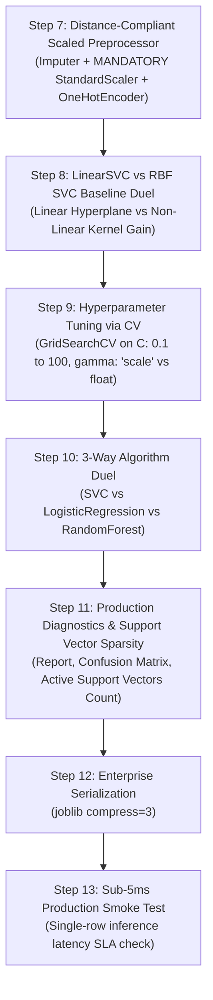

# ⚡ Support Vector Classifier (SVC) Master Guide: Asan Bhasha Me Pura Concept & Saare Steps

> **Dumb Student Summary (Dimag me fit karne wali real life kahani):**  
> Maan lo do dushman desho (Red Army vs Blue Army) ke beech border khinch na hai:  
> - **Logistic Regression ka Dimaag:** Koi bhi line bana deta hai jisse dono armies alag ho jayein (bhale hi line kisi ek soldier ke bilkul naak ke paas se nikal rahi ho). Thodi si halchal hui to vivaad ho jayega!  
> - **Support Vector Classifier (SVC) ka Dimaag (Maximum Margin Champion):**  
>   SVC kehta hai: *"Mujhe aisi sadak (Hyperplane) banani hai jiska divider dono armies se zyada se zyada door ho!"* (Maximum Margin Hyperplane).  
> - **Support Vectors Kaun Hain?**  
>   Border ke theek kinare khade wo 2-3 sabse aage wale soldiers (hardest samples) jo divider ki line tay karte hain. Baaki 99% soldiers peeche chahe jahan marzi baithe hon, border ki line unse change nahi hogi!  
> - **The Kernel Trick (Jadu ki Chhadi):**  
>   Agar 2D zameen par Red soldiers ne Blue soldiers ko chaaro taraf se gher rakha hai (concentric circle), to seedhi line se divide nahi kiya ja sakta.  
>   👉 **Kernel Trick (RBF / Poly):** SVC zameen ko 3D hawa me utha deta hai ($z = x^2 + y^2$). Jaise hi Blue soldiers upar uthte hain, beech me se ek sheet (Hyperplane) daal kar dono ko alag kar deta hai!

---

## 🧭 SVC ke 4 Critical Rules (Interview & Production Traps)

```
       (Red)   x                   │ (Margin)
            x      x   [Support] ──┼──> ★ (Red border soldier)
                                   │
   ────────────────────────────────┼───────────────────────────────── [HYPERPLANE: w^T x + b = 0]
                                   │
                       [Support] ──┼──> ● (Blue border soldier)
             ●      ●              │ (Margin)
        (Blue)   ●
```

1. **Rule 1: MANDATORY FEATURE SCALING (StandardScaler):**  
   SVC dot products aur Euclidean distance ($\|w\|^2$) par chalta hai.  
   - Agar ek feature ₹1,00,000 me hai aur doosra $0.5$ me, to bada feature pure margin ko swallow kar lega.  
   - 👉 **StandardScaler ke bina SVC 100% fail hota hai!**
2. **Rule 2: $C$ Parameter (Tension / Penalty Budget):**  
   - **Bada $C$ (Strict Teacher):** Galti bardasht nahi karega (Low bias, high variance $\implies$ **Overfitting** ka risk). Margin chota banega.  
   - **Chota $C$ (Chill Teacher):** Thodi galtiyan allow karega (High bias, low variance $\implies$ **Underfitting**). Margin chauda banega.
3. **Rule 3: $\gamma$ (Gamma) Parameter (RBF Curvature / Bell Curve Width):**  
   - **Bada $\gamma$:** Har single data point ke ird-gird ek tight island banata hai ($\implies$ **Extreme Overfitting**).  
   - **Chota $\gamma$:** Smooth, flat boundary banata hai.
4. **Rule 4: Scalability Trap ($O(N^2)$ to $O(N^3)$):**  
   Agar dataset me $N > 50,000$ rows hain, to non-linear `SVC(kernel='rbf')` computer ko hang kar sakta hai.  
   - Huge datasets par: Ya to **`LinearSVC`** use karein, ya data sample karein, ya SGDClassifier lagayein!

---

## 📋 End-to-End Enterprise 7-Step Pipeline (Step 7 se 13)

Har ek SVC notebook me ye 7 steps bilkul identical rehte hain taaki seedha dimag me chap jaye:



---

### ⚙️ STEP 7: DISTANCE-COMPLIANT SCALED PREPROCESSOR
* **Kyu chahiye?** Sarre numeric features ko unit variance me lana taaki support vector margins symmetrical rahein.

```python
from sklearn.compose import ColumnTransformer
from sklearn.pipeline import Pipeline
from sklearn.impute import SimpleImputer
from sklearn.preprocessing import StandardScaler, OneHotEncoder
import numpy as np

num_cols = X_train.select_dtypes(include=[np.number]).columns.tolist()
cat_cols = X_train.select_dtypes(include=['object', 'category', 'string']).columns.tolist()

num_pipeline = Pipeline([
    ('imputer', SimpleImputer(strategy='median')),
    ('scaler', StandardScaler()) # Non-negotiable for Support Vector Machines!
])

cat_pipeline = Pipeline([
    ('imputer', SimpleImputer(strategy='most_frequent')),
    ('ohe', OneHotEncoder(drop='first', handle_unknown='ignore', sparse_output=False))
])

transformers = []
if len(num_cols) > 0:
    transformers.append(('num', num_pipeline, num_cols))
if len(cat_cols) > 0:
    transformers.append(('cat', cat_pipeline, cat_cols))

preprocessor = ColumnTransformer(transformers=transformers, remainder='drop') if len(transformers) > 0 else 'passthrough'
print("✅ STEP 7: Distance-Compliant Scaled Preprocessor Ready.")
```

---

### ⚠️ STEP 8: BASELINE DUEL (LinearSVC vs RBF SVC)
* **Kyu chahiye?** Ye dekhne ke liye ki kya data me non-linear kernel (RBF) lagane se sach me accuracy badh rahi hai ya flat plane hi kaafi hai.

```python
from sklearn.svm import LinearSVC, SVC
from sklearn.metrics import accuracy_score

pipe_lin = Pipeline([('prep', preprocessor), ('svc', LinearSVC(dual=False, random_state=42))])
pipe_lin.fit(X_train, y_train)

pipe_rbf = Pipeline([('prep', preprocessor), ('svc', SVC(kernel='rbf', random_state=42))])
pipe_rbf.fit(X_train, y_train)

acc_lin = accuracy_score(y_test, pipe_lin.predict(X_test))
acc_rbf = accuracy_score(y_test, pipe_rbf.predict(X_test))

print("="*65)
print(f"Linear SVC Test Accuracy : {acc_lin*100:.2f}% (Flat Hyperplane)")
print(f"RBF Kernel Test Accuracy : {acc_rbf*100:.2f}% (Infinite-D Hilbert Space)")
print(f"Non-Linear Kernel Leap   : +{(acc_rbf - acc_lin)*100:.2f}%")
print("="*65)
```

---

### 🎯 STEP 9: HYPERPARAMETER TUNING ($C$ + $\gamma$) VIA 5-FOLD CV
* **Kyu chahiye?** Best penalty budget $C$ aur kernel curvature $\gamma$ dhoondhna taaki model overfit na ho.

```python
from sklearn.model_selection import GridSearchCV, StratifiedKFold

param_grid = {
    'svc__C': [0.1, 1, 10, 100],
    'svc__gamma': ['scale', 'auto', 0.01, 0.1]
}

cv = StratifiedKFold(n_splits=5, shuffle=True, random_state=42)
pipe_tune = Pipeline([('prep', preprocessor), ('svc', SVC(kernel='rbf', random_state=42))])

grid = GridSearchCV(pipe_tune, param_grid=param_grid, cv=cv, scoring='accuracy', n_jobs=-1)
grid.fit(X_train, y_train)

best_svc = grid.best_estimator_
print(f"🏆 Best Hyperparameters: {grid.best_params_}")
print(f"🎯 Best 5-Fold CV Score: {grid.best_score_*100:.2f}%")
```

---

### ⚔️ STEP 10: ALGORITHM DUEL (SVC vs Logistic Regression vs Random Forest)
* **Kyu chahiye?** Maximum margin classifier ko linear baseline aur tree ensemble ke saath benchmark karna.

```python
from sklearn.linear_model import LogisticRegression
from sklearn.ensemble import RandomForestClassifier

pipe_lr = Pipeline([('prep', preprocessor), ('lr', LogisticRegression(max_iter=1000, random_state=42))])
pipe_lr.fit(X_train, y_train)

pipe_rf = Pipeline([('prep', preprocessor), ('rf', RandomForestClassifier(n_estimators=100, random_state=42))])
pipe_rf.fit(X_train, y_train)

score_svc = best_svc.score(X_test, y_test)
score_lr  = pipe_lr.score(X_test, y_test)
score_rf  = pipe_rf.score(X_test, y_test)

print("="*65)
print(f"Support Vector Classifier (Tuned): {score_svc*100:.2f}% (Max-Margin Boundary)")
print(f"Logistic Regression Baseline     : {score_lr*100:.2f}% (Probabilistic Linear)")
print(f"Random Forest Classifier         : {score_rf*100:.2f}% (Bagged Orthogonal Splits)")
print("="*65)
```

---

### 📊 STEP 11: SUPPORT VECTOR SPARSITY & CLASSIFICATION REPORT
* **Kyu chahiye?** Support Vectors ki sankhya check karna. Agar bohot zyada support vectors use ho rahe hain ($> 80\%$ data), to model overfit ho raha hai.

```python
from sklearn.metrics import classification_report, confusion_matrix

y_pred = best_svc.predict(X_test)
svc_model = best_svc.named_steps['svc']
n_sv = len(svc_model.support_)
sparsity = (1.0 - (n_sv / len(X_train))) * 100

print(classification_report(y_test, y_pred))
print(f"Active Support Vectors: {n_sv} / {len(X_train)} (Model Sparsity: {sparsity:.1f}%)")
print("Confusion Matrix:\n", confusion_matrix(y_test, y_pred))
```

---

### 💾 STEP 12 & 13: PRODUCTION SERIALIZATION & SUB-5MS SMOKE TEST
* **Kyu chahiye?** Pipeline ko save karna aur live single-sample prediction latency check karna.

```python
import joblib
import time
import os

# Step 12: Serialize Model
os.makedirs('production_models', exist_ok=True)
model_path = 'production_models/best_svc_model.joblib'
joblib.dump(best_svc, model_path, compress=3)

# Step 13: Live Latency Smoke Test
loaded_model = joblib.load(model_path)
sample = X_test.iloc[[0]]

t0 = time.perf_counter()
pred = loaded_model.predict(sample)
latency_ms = (time.perf_counter() - t0) * 1000

print(f"Predicted Class : {pred[0]}")
print(f"Single Latency  : {latency_ms:.3f} ms (SLA < 5ms: {'PASS' if latency_ms < 5 else 'CHECK'})")
```
