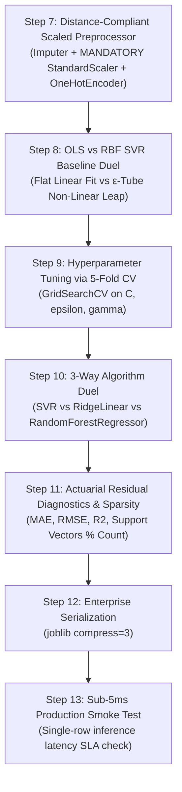

# ⚡ Support Vector Regressor (SVR) Master Guide: Asan Bhasha Me Pura Concept & Saare Steps

> **Dumb Student Summary (Dimag me fit karne wali real life kahani):**  
> Maan lo aap car ki price ya insurance cost predict karne ke liye ek regression line khinch rahe ho:  
> - **Ordinary Linear Regression (OLS):** Har ek point ki thodi si bhi galti (residual $y - \hat{y}$) par ro padta hai aur unka square karke minimize karta hai. Agar ek ajeeb outlier aa gaya, to poori line uske chakkar me tedhi ho jaati hai!  
> - **Support Vector Regressor (SVR) ka Dimaag (The $\varepsilon$-Insensitive Tube):**  
>   SVR kehta hai: *"Chhoti-moti galtiyon par main bilkul dhyan nahi dunga!"*  
>   Wo apni line ke upar aur neeche ek rubber ki tube (hollow pipe) pehna deta hai jiski motayi $\pm \varepsilon$ (epsilon) hoti hai.  
>   - **Tube ke andar jo points gire:** SVR unhe **ZERO penalty** deta hai (unka loss = 0)!  
>   - **Tube ke bahar jo points gire:** Sirf unhi points par penalty lagti hai (slack variables $\xi_i$), aur wahi bante hain **Support Vectors**!  
> - **Outlier Immunity:** Kyunki loss linear hota hai (squared nahi), SVR bade outliers se bilkul nahi darta!

---

## 🧭 SVR ke The "Holy Trinity" Hyperparameters ($C$, $\varepsilon$, $\gamma$)

```
             y  ▲                       Upper Boundary (y + ε)
                │      ●        ●   ───────────────────────
                │          ●       /  Tube (Loss = 0)
                │   [SV] ★        /
                │─────────────── / ──────────────────────── Best Fit Curve f(x)
                │        ●      /
                │   ─────────────────────── Lower Boundary (y - ε)
                │             [SV] ★ (Outside tube: Penalized by C)
                └───────────────────────────────► x
```

1. **$\varepsilon$ (Epsilon - Tube ki Chaudaai):**  
   - **Bada $\varepsilon$:** Moti tube. Zyada points tube ke andar aa jayenge $\implies$ Kam support vectors, ultra-fast model, par thoda underfit ho sakta hai.  
   - **Chota $\varepsilon$ ($\to 0$):** Patli tube. Har point bahar rahega $\implies$ Zyada support vectors, slow model, overfitting ka khatra.
2. **$C$ (Penalty Budget):**  
   - Tube ke bahar gire points ko kitni sazaa (penalty) deni hai. Bada $C$ tube ke bahar koi point bardasht nahi karta.
3. **$\gamma$ (Gamma - RBF Curvature):**  
   - Non-linear curve kitna ghumaav-daar (curvy) hoga. Bada $\gamma$ points ke around sharp spikes banata hai.
4. **MANDATORY SCALING RULE:**  
   $X$ aur kabhi-kabhi continuous target $y$ dono ko scale karna padta hai agar target ka scale bohot bada ho (e.g., House prices in millions).

---

## 📋 End-to-End Enterprise 7-Step Pipeline (Step 7 se 13)

Har ek SVR notebook me ye 7 steps bilkul identical rehte hain taaki seedha dimag me chap jaye:



---

### ⚙️ STEP 7: DISTANCE-COMPLIANT SCALED PREPROCESSOR
* **Kyu chahiye?** Sare numeric features ko unit variance me lana taaki epsilon tube symmetrical rahe.

```python
from sklearn.compose import ColumnTransformer
from sklearn.pipeline import Pipeline
from sklearn.impute import SimpleImputer
from sklearn.preprocessing import StandardScaler, OneHotEncoder
import numpy as np

num_cols = X_train.select_dtypes(include=[np.number]).columns.tolist()
cat_cols = X_train.select_dtypes(include=['object', 'category', 'string']).columns.tolist()

num_pipeline = Pipeline([
    ('imputer', SimpleImputer(strategy='median')),
    ('scaler', StandardScaler()) # Compulsory for SVR!
])

cat_pipeline = Pipeline([
    ('imputer', SimpleImputer(strategy='most_frequent')),
    ('ohe', OneHotEncoder(drop='first', handle_unknown='ignore', sparse_output=False))
])

transformers = []
if len(num_cols) > 0:
    transformers.append(('num', num_pipeline, num_cols))
if len(cat_cols) > 0:
    transformers.append(('cat', cat_pipeline, cat_cols))

preprocessor = ColumnTransformer(transformers=transformers, remainder='drop') if len(transformers) > 0 else 'passthrough'
print("✅ STEP 7: Scaled Preprocessor Ready.")
```

---

### ⚠️ STEP 8: BASELINE DUEL (Linear Regression vs RBF SVR)
* **Kyu chahiye?** OLS baseline ke comparison me $\varepsilon$-insensitive RBF SVR ka accuracy leap dekhna.

```python
from sklearn.linear_model import LinearRegression
from sklearn.svm import SVR
from sklearn.metrics import r2_score, mean_absolute_error

pipe_ols = Pipeline([('prep', preprocessor), ('ols', LinearRegression())])
pipe_ols.fit(X_train, y_train)

pipe_svr_base = Pipeline([('prep', preprocessor), ('svr', SVR(kernel='rbf', C=1000, epsilon=0.1))])
pipe_svr_base.fit(X_train, y_train)

r2_ols = r2_score(y_test, pipe_ols.predict(X_test))
r2_svr = r2_score(y_test, pipe_svr_base.predict(X_test))

print("="*65)
print(f"OLS Linear Regression R² : {r2_ols*100:.2f}% | MAE: {mean_absolute_error(y_test, pipe_ols.predict(X_test)):.2f}")
print(f"RBF SVR Baseline R²      : {r2_svr*100:.2f}% | MAE: {mean_absolute_error(y_test, pipe_svr_base.predict(X_test)):.2f}")
print(f"Non-Linear Accuracy Leap : +{(r2_svr - r2_ols)*100:.2f}%")
print("="*65)
```

---

### 🎯 STEP 9: TUNING HYPERPARAMETERS ($C$, $\varepsilon$, $\gamma$) VIA 5-FOLD CV
* **Kyu chahiye?** Penalty budget $C$, tube width $\varepsilon$, aur curvature $\gamma$ ka optimum balance nikalna.

```python
from sklearn.model_selection import GridSearchCV, KFold

param_grid = {
    'svr__C': [100, 1000, 5000],
    'svr__epsilon': [0.01, 0.1, 0.5],
    'svr__gamma': ['scale', 0.05, 0.1]
}

cv = KFold(n_splits=5, shuffle=True, random_state=42)
pipe_tune = Pipeline([('prep', preprocessor), ('svr', SVR(kernel='rbf'))])

grid = GridSearchCV(pipe_tune, param_grid=param_grid, cv=cv, scoring='r2', n_jobs=-1)
grid.fit(X_train, y_train)

best_svr = grid.best_estimator_
print(f"🏆 Best Hyperparameters: {grid.best_params_}")
print(f"🎯 Best 5-Fold CV R²   : {grid.best_score_*100:.2f}%")
```

---

### ⚔️ STEP 10: ALGORITHM DUEL (SVR vs Ridge Linear vs Random Forest)
* **Kyu chahiye?** Check karna ki support vector regression continuous surfaces par ensemble trees aur regularized linear models se kaisa compete karta hai.

```python
from sklearn.linear_model import Ridge
from sklearn.ensemble import RandomForestRegressor

pipe_ridge = Pipeline([('prep', preprocessor), ('ridge', Ridge())])
pipe_ridge.fit(X_train, y_train)

pipe_rf = Pipeline([('prep', preprocessor), ('rf', RandomForestRegressor(n_estimators=100, random_state=42, n_jobs=-1))])
pipe_rf.fit(X_train, y_train)

r2_best_svr = r2_score(y_test, best_svr.predict(X_test))
r2_ridge    = r2_score(y_test, pipe_ridge.predict(X_test))
r2_rf       = r2_score(y_test, pipe_rf.predict(X_test))

print("="*65)
print(f"Support Vector Regressor R²: {r2_best_svr*100:.2f}% (ε-Insensitive Kernel)")
print(f"Ridge Linear Baseline R²   : {r2_ridge*100:.2f}% (L2 Regularized Hyperplane)")
print(f"Random Forest Regressor R² : {r2_rf*100:.2f}% (Non-linear Bagged Trees)")
print("="*65)
```

---

### 📊 STEP 11: RESIDUALS & SUPPORT VECTOR SPARSITY
* **Kyu chahiye?** Error metrics aur active support vectors ki sankhya measure karna (kitne points tube ke bahar gire).

```python
import numpy as np

y_pred = best_svr.predict(X_test)
residuals = y_test - y_pred

mae = mean_absolute_error(y_test, y_pred)
rmse = np.sqrt(np.mean(residuals**2))
sv_count = len(best_svr.named_steps['svr'].support_)
sparsity = (1.0 - (sv_count / len(X_train))) * 100

print(f"Mean Absolute Error (MAE): {mae:.4f}")
print(f"Root Mean Squared Error  : {rmse:.4f}")
print(f"Active Support Vectors   : {sv_count} / {len(X_train)} (Model Sparsity: {sparsity:.1f}%)")
```

---

### 💾 STEP 12 & 13: PRODUCTION SERIALIZATION & SUB-5MS SMOKE TEST
* **Kyu chahiye?** Model artifact save karna aur live single-sample prediction latency verify karna.

```python
import joblib
import time
import os

# Step 12: Atomic Serialization
os.makedirs('production_models', exist_ok=True)
model_path = 'production_models/best_svr_model.joblib'
joblib.dump(best_svr, model_path, compress=3)

# Step 13: Live Latency Smoke Test
loaded_model = joblib.load(model_path)
sample = X_test.iloc[[0]]

t0 = time.perf_counter()
pred = loaded_model.predict(sample)
latency_ms = (time.perf_counter() - t0) * 1000

print(f"Predicted Value : {pred[0]:.4f}")
print(f"Single Latency  : {latency_ms:.3f} ms (SLA < 5ms: {'PASS' if latency_ms < 5 else 'CHECK'})")
```
