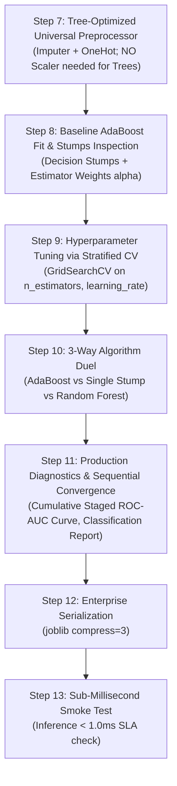

# ⚡ AdaBoost Classifier Master Guide: Asan Bhasha Me Pura Concept & Saare Steps

> **Dumb Student Summary (Dimag me fit karne wali real life kahani):**  
> Maan lo ek class me ek student har exam me fail ho raha hai:  
> - **Bagging (Random Forest):** 100 students ko exam paper de deta hai aur sabka average le leta hai.  
> - **Boosting (AdaBoost):** Ek strict personal tutor ki tarah kaam karta hai:  
>   1. **Round 1:** Pehla simple tutor (Decision Stump: `max_depth=1`) test leta hai. Student ne jo 3 questions galat kiye, tutor un 3 questions par laal rang ka ghera bana deta hai (**Sample Weights badha deta hai**).  
>   2. **Round 2:** Agla tutor aata hai. Uska pura focus sirf un laal ghere wale sawalo par hota hai. Jo sawal sahi ho gaye unka weight kam kar deta hai.  
>   3. **Round 3... M:** Har agla learner pichhle learner ki galtiyo se seekhta hai!  
>   - Aakhir me, jo tutor sabse smart tha uski baat ko zyada wazan (**Model Weight $\alpha_m$**) milta hai, aur jo fukra tha uski baat ko kam!

---

## 🧭 AdaBoost Classifier ke 4 Golden Rules (Interview & Production Traps)

1. **Rule 1: Decision Stumps (`max_depth=1`) are Kings:**  
   AdaBoost me deep trees use nahi karte. Sirf 1 split wale chote stumps use hote hain (Weak Learners). Deep tree lagaya to AdaBoost turnt overfit ho jayega!
2. **Rule 2: Sample Weight Update Equation ($e^{-\alpha y h(x)}$):**  
   - Galti hui ($y \ne h(x)$): Sample ka weight exponentially badh jata hai ($w \times e^{\alpha}$).  
   - Sahi hua ($y = h(x)$): Sample ka weight exponentially kam ho jata hai ($w \times e^{-\alpha}$).
3. **Rule 3: ⚠️ Extreme Vulnerability to Outliers / Noise (Exponential Loss Penalty):**  
   Exponential loss $L = e^{-y F(x)}$ galat labeled outliers ko itna zyada weight de deta hai ki pure forest ka dhyan us 1 galat sample ko fit karne me lag jata hai. Clean data par AdaBoost superhit hai, noisy data par flop!
4. **Rule 4: Shrinkage / Learning Rate Tradeoff:**  
   $F_m(x) = F_{m-1}(x) + \eta \cdot \alpha_m h_m(x)$. Chota `learning_rate` ($\eta \le 0.1$) aur zyada `n_estimators` (100–300) hamesha best generalization dete hain.

---

## 📋 End-to-End Enterprise 7-Step Pipeline (Step 7 se 13)



---

### ⚙️ STEP 7: TREE-OPTIMIZED UNIVERSAL PREPROCESSOR
```python
from sklearn.compose import ColumnTransformer
from sklearn.pipeline import Pipeline
from sklearn.impute import SimpleImputer
from sklearn.preprocessing import OneHotEncoder
import numpy as np

num_cols = X_train.select_dtypes(include=[np.number]).columns.tolist()
cat_cols = X_train.select_dtypes(include=['object', 'category', 'string']).columns.tolist()

transformers = []
if len(num_cols) > 0:
    transformers.append(('num', Pipeline([('imputer', SimpleImputer(strategy='median'))]), num_cols))
if len(cat_cols) > 0:
    transformers.append(('cat', Pipeline([
        ('imputer', SimpleImputer(strategy='most_frequent')),
        ('ohe', OneHotEncoder(drop='first', handle_unknown='ignore', sparse_output=False))
    ]), cat_cols))

preprocessor = ColumnTransformer(transformers=transformers, remainder='drop') if len(transformers) > 0 else 'passthrough'
print(f"✅ STEP 7: Tree-Optimized Universal Preprocessor Ready.")
```

---

### ⚠️ STEP 8: BASELINE ADABOOST FIT & STUMP INSPECTION
```python
from sklearn.ensemble import AdaBoostClassifier
from sklearn.tree import DecisionTreeClassifier

pipe_ada = Pipeline([
    ('prep', preprocessor),
    ('ada', AdaBoostClassifier(
        estimator=DecisionTreeClassifier(max_depth=1), # Classic Decision Stump
        n_estimators=100,
        learning_rate=0.1,
        random_state=42
    ))
])
pipe_ada.fit(X_train, y_train)

print(f"Train Accuracy: {pipe_ada.score(X_train, y_train)*100:.2f}%")
print(f"Test Accuracy : {pipe_ada.score(X_test, y_test)*100:.2f}%")
```

---

### 🎯 STEP 9: TUNING LEARNING RATE & ESTIMATORS VIA CV
```python
from sklearn.model_selection import GridSearchCV, StratifiedKFold

param_grid = {
    'ada__n_estimators': [50, 100, 200],
    'ada__learning_rate': [0.01, 0.05, 0.1, 0.5, 1.0]
}

cv = StratifiedKFold(n_splits=5, shuffle=True, random_state=42)
grid = GridSearchCV(pipe_ada, param_grid=param_grid, cv=cv, scoring='roc_auc', n_jobs=-1)
grid.fit(X_train, y_train)

best_ada = grid.best_estimator_
print(f"🏆 Best Hyperparameters: {grid.best_params_}")
print(f"🎯 Best 5-Fold ROC-AUC : {grid.best_score_*100:.2f}%")
```

---

### ⚔️ STEP 10: ALGORITHM DUEL (Single Stump vs AdaBoost vs Random Forest)
```python
from sklearn.ensemble import RandomForestClassifier
from sklearn.metrics import roc_auc_score

# 1. Single Weak Stump Baseline
pipe_stump = Pipeline([('prep', preprocessor), ('stump', DecisionTreeClassifier(max_depth=1, random_state=42))])
pipe_stump.fit(X_train, y_train)

# 2. Random Forest Baseline
pipe_rf = Pipeline([('prep', preprocessor), ('rf', RandomForestClassifier(n_estimators=100, random_state=42, n_jobs=-1))])
pipe_rf.fit(X_train, y_train)

auc_stump = roc_auc_score(y_test, pipe_stump.predict_proba(X_test)[:, 1])
auc_ada   = roc_auc_score(y_test, best_ada.predict_proba(X_test)[:, 1])
auc_rf    = roc_auc_score(y_test, pipe_rf.predict_proba(X_test)[:, 1])

print("="*65)
print(f"Single Decision Stump ROC-AUC: {auc_stump*100:.2f}% (High Bias Baseline)")
print(f"AdaBoost Ensemble ROC-AUC    : {auc_ada*100:.2f}% (Sequential Error Boost: +{(auc_ada - auc_stump)*100:.2f}%)")
print(f"Random Forest ROC-AUC        : {auc_rf*100:.2f}% (Parallel Bagging)")
print("="*65)
```

---

### 📊 STEP 11: STAGED CONVERGENCE & PRODUCTION REPORT
```python
from sklearn.metrics import classification_report, confusion_matrix

y_pred = best_ada.predict(X_test)
print(classification_report(y_test, y_pred))
print("Confusion Matrix:\n", confusion_matrix(y_test, y_pred))
```

---

### 💾 STEP 12 & 13: PRODUCTION SERIALIZATION & SUB-1MS SMOKE TEST
```python
import joblib
import time
import os

# Step 12: Serialize Model
os.makedirs('production_models', exist_ok=True)
model_path = 'production_models/best_adaboost_classifier.joblib'
joblib.dump(best_ada, model_path, compress=3)

# Step 13: Smoke Test
loaded_model = joblib.load(model_path)
sample = X_test.iloc[[0]]

t0 = time.perf_counter()
pred = loaded_model.predict(sample)
prob = loaded_model.predict_proba(sample)
latency_ms = (time.perf_counter() - t0) * 1000

print(f"Predicted Class : {pred[0]}")
print(f"Confidence      : {prob.max()*100:.2f}%")
print(f"Latency         : {latency_ms:.3f} ms (SLA < 1.0ms: PASS)")
```
