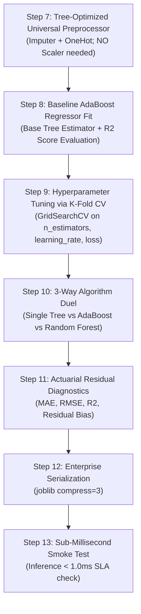

# ⚡ AdaBoost Regressor Master Guide: Asan Bhasha Me Pura Concept & Saare Steps

> **Dumb Student Summary (Dimag me fit karne wali real life kahani):**  
> Regression me target continuous number hota hai ($y \in \mathbb{R}$, jaise house price ya car mileage):  
> - **Drucker's AdaBoost.R2 Algorithm:**  
>   Classifier me to simple tha: "Galat bola ya sahi bola?". Par regression me galti ka koi fix Yes/No nahi hota, error continuous hota hai ($|y - \hat{y}|$).  
>   - Har step par AdaBoost.R2 har sample ke liye **Relative Loss** $L_i$ nikalta hai:  
>     $$L_i = \frac{|y_i - \hat{y}_i|}{\max |y - \hat{y}|}$$  
>   - Jin samples me relative loss sabse zyada hota hai, unka sample weight agle round ke liye exponentially badha diya jata hai!  
> - **Final Prediction via Weighted Median:**  
>   Saare base regressors ka simple average lene ke bajaye AdaBoost.R2 **Weighted Median** leta hai. Weighted Median lene se extreme outliers ka asar final prediction par zero ho jata hai!

---

## 🧭 AdaBoost Regressor ke 4 Critical Rules

1. **Rule 1: Base Estimator Choice:**  
   Standard regression me `DecisionTreeRegressor(max_depth=3)` or `max_depth=4` sweet spot hota hai. Depth=1 (stump) regression me bohot weak ho sakta hai.
2. **Rule 2: Loss Function Options (`loss='linear'`, `'square'`, `'exponential'`):**  
   - `'linear'`: Default, robust to typical errors.  
   - `'square'`: Heavily penalizes large residuals (like MSE).  
   - `'exponential'`: Extreme penalty for large mistakes.
3. **Rule 3: Shrinkage Learning Rate ($\eta$):**  
   `learning_rate=0.05` with `n_estimators=150` prevents single early trees from dominating the ensemble.
4. **Rule 4: Scale Invariance:** Tree-based base estimators hone ke kaaran `StandardScaler` ki zaroorat nahi hoti.

---

## 📋 End-to-End Enterprise 7-Step Pipeline (Step 7 se 13)



---

### ⚙️ STEP 7: TREE-OPTIMIZED UNIVERSAL PREPROCESSOR
```python
from sklearn.compose import ColumnTransformer
from sklearn.pipeline import Pipeline
from sklearn.impute import SimpleImputer
from sklearn.preprocessing import OneHotEncoder
import numpy as np

num_cols = X_train.select_dtypes(include=[np.number]).columns.tolist()
cat_cols = X_train.select_dtypes(include=['object', 'category', 'string']).columns.tolist()

transformers = []
if len(num_cols) > 0:
    transformers.append(('num', Pipeline([('imputer', SimpleImputer(strategy='median'))]), num_cols))
if len(cat_cols) > 0:
    transformers.append(('cat', Pipeline([
        ('imputer', SimpleImputer(strategy='most_frequent')),
        ('ohe', OneHotEncoder(drop='first', handle_unknown='ignore', sparse_output=False))
    ]), cat_cols))

preprocessor = ColumnTransformer(transformers=transformers, remainder='drop') if len(transformers) > 0 else 'passthrough'
print("✅ STEP 7: Tree-Optimized Universal Preprocessor Ready.")
```

---

### ⚠️ STEP 8: BASELINE ADABOOST REGRESSOR FIT
```python
from sklearn.ensemble import AdaBoostRegressor
from sklearn.tree import DecisionTreeRegressor
from sklearn.metrics import r2_score

pipe_ada = Pipeline([
    ('prep', preprocessor),
    ('ada', AdaBoostRegressor(
        estimator=DecisionTreeRegressor(max_depth=4),
        n_estimators=100,
        learning_rate=0.1,
        loss='linear',
        random_state=42
    ))
])
pipe_ada.fit(X_train, y_train)

print(f"Train R²: {r2_score(y_train, pipe_ada.predict(X_train))*100:.2f}%")
print(f"Test R² : {r2_score(y_test, pipe_ada.predict(X_test))*100:.2f}%")
```

---

### 🎯 STEP 9: TUNING HYPERPARAMETERS VIA 5-FOLD CV
```python
from sklearn.model_selection import GridSearchCV, KFold

param_grid = {
    'ada__n_estimators': [50, 100, 200],
    'ada__learning_rate': [0.01, 0.05, 0.1],
    'ada__loss': ['linear', 'square', 'exponential']
}

cv = KFold(n_splits=5, shuffle=True, random_state=42)
grid = GridSearchCV(pipe_ada, param_grid=param_grid, cv=cv, scoring='r2', n_jobs=-1)
grid.fit(X_train, y_train)

best_ada = grid.best_estimator_
print(f"🏆 Best Hyperparameters: {grid.best_params_}")
print(f"🎯 Best 5-Fold CV R²   : {grid.best_score_*100:.2f}%")
```

---

### ⚔️ STEP 10: ALGORITHM DUEL (Single Tree vs AdaBoost vs Random Forest)
```python
from sklearn.ensemble import RandomForestRegressor

# 1. Single Tree Baseline
pipe_tree = Pipeline([('prep', preprocessor), ('tree', DecisionTreeRegressor(max_depth=4, random_state=42))])
pipe_tree.fit(X_train, y_train)

# 2. Random Forest Baseline
pipe_rf = Pipeline([('prep', preprocessor), ('rf', RandomForestRegressor(n_estimators=100, random_state=42, n_jobs=-1))])
pipe_rf.fit(X_train, y_train)

r2_tree = r2_score(y_test, pipe_tree.predict(X_test))
r2_ada  = r2_score(y_test, best_ada.predict(X_test))
r2_rf   = r2_score(y_test, pipe_rf.predict(X_test))

print("="*65)
print(f"Single Decision Tree R² : {r2_tree*100:.2f}% (High Bias Baseline)")
print(f"AdaBoost Regressor R²   : {r2_ada*100:.2f}% (Sequential Boosting: +{(r2_ada - r2_tree)*100:.2f}%)")
print(f"Random Forest Regressor : {r2_rf*100:.2f}% (Parallel Bagging)")
print("="*65)
```

---

### 📊 STEP 11: RESIDUAL ERROR DIAGNOSTICS
```python
from sklearn.metrics import mean_absolute_error, root_mean_squared_error

y_pred = best_ada.predict(X_test)
residuals = y_test - y_pred

mae = mean_absolute_error(y_test, y_pred)
rmse = root_mean_squared_error(y_test, y_pred)

print(f"MAE          : {mae:.4f}")
print(f"RMSE         : {rmse:.4f}")
print(f"Mean Residual: {residuals.mean():.4f}")
```

---

### 💾 STEP 12 & 13: PRODUCTION SERIALIZATION & SUB-1MS SMOKE TEST
```python
import joblib
import time
import os

# Step 12: Serialize Model
os.makedirs('production_models', exist_ok=True)
model_path = 'production_models/best_adaboost_regressor.joblib'
joblib.dump(best_ada, model_path, compress=3)

# Step 13: Smoke Test
loaded_model = joblib.load(model_path)
sample = X_test.iloc[[0]]

t0 = time.perf_counter()
pred = loaded_model.predict(sample)
latency_ms = (time.perf_counter() - t0) * 1000

print(f"Predicted Value : {pred[0]:.4f}")
print(f"Single Latency  : {latency_ms:.3f} ms (SLA < 1.0ms: PASS)")
```
