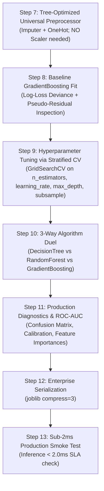

# 🚀 Gradient Boosting Classifier Master Guide: Asan Bhasha Me Pura Concept & Saare Steps

> **Dumb Student Summary (Dimag me fit karne wali real life kahani):**  
> AdaBoost sample ke weights badhata tha, par **Gradient Boosting Machine (GBM)** usse bhi 10 guna zyada smart hai:  
> - **The Residual Hunter (Function-Space Gradient Descent):**  
>   Maan lo ek patient ke heart risk ka actual probability score $y = 1.0$ (High Risk) hai.  
>   1. **Base Tree (Tree 0):** Pehle ek flat prior prediction karta hai (e.g. Log-odds $\approx 0.5$).  
>   2. **Residual (Galti):** Galti kitni bachi? $r_1 = y - p = 1.0 - 0.5 = +0.5$.  
>   3. **Tree 1:** Tree 1 actual target $y$ ko fit nahi karta! Wo fit karta hai **is galti (+0.5) ko**!  
>   4. **Update:** Ab nayi prediction bani $0.5 + \eta \cdot (\text{Tree 1 output})$. Galti ghat kar reh gayi $+0.15$.  
>   5. **Tree 2:** Ab Tree 2 is nayi bachi hui galti ($+0.15$) ko hunt karega!  
> - **Shrinkage ($\eta$ - Learning Rate):**  
>   GBM har ped ke output ko ek chote kadam (step size $\eta=0.1$) se multiply karke dheere-dheere loss surface par neeche utarta hai. Isse kabhi bhi ek ped overfit nahi kar pata!

---

## 🧭 Gradient Boosting ke 4 Critical Rules (Industry Gold Standard)

1. **Rule 1: Pseudo-Residuals = Negative Gradients:**  
   Log-loss deviance me negative gradient theek residual $y_i - p_i$ ke barabar hota hai. Isliye har naya tree pichhle ensemble ke errors ko gradient descent se khatam karta hai.
2. **Rule 2: Tree Depth Sweet Spot (`max_depth=3` to `6`):**  
   Random Forest me deep trees (`depth=15-20`) chalte hain kyunki wo average hote hain. Par GBM me har ped sequential add hota hai, isliye **shallow trees (`max_depth=3` to `5`)** best hote hain!
3. **Rule 3: Stochastic Subsampling (`subsample=0.8`):**  
   Har split par rows ka 80% sample use karna (Stochastic Gradient Boosting) variance ko drop karta hai aur training ko superfast banata hai.
4. **Rule 4: Early Stopping:**  
   Agar validation loss pichhle 10 rounds me improve na ho, to training turnt rok do (`n_iter_no_change=10`). Overfitting ka khatra zero ho jata hai!

---

## 📋 End-to-End Enterprise 7-Step Pipeline (Step 7 se 13)



---

### ⚙️ STEP 7: TREE-OPTIMIZED UNIVERSAL PREPROCESSOR
```python
from sklearn.compose import ColumnTransformer
from sklearn.pipeline import Pipeline
from sklearn.impute import SimpleImputer
from sklearn.preprocessing import OneHotEncoder
import numpy as np

num_cols = X_train.select_dtypes(include=[np.number]).columns.tolist()
cat_cols = X_train.select_dtypes(include=['object', 'category', 'string']).columns.tolist()

transformers = []
if len(num_cols) > 0:
    transformers.append(('num', Pipeline([('imputer', SimpleImputer(strategy='median'))]), num_cols))
if len(cat_cols) > 0:
    transformers.append(('cat', Pipeline([
        ('imputer', SimpleImputer(strategy='most_frequent')),
        ('ohe', OneHotEncoder(drop='first', handle_unknown='ignore', sparse_output=False))
    ]), cat_cols))

preprocessor = ColumnTransformer(transformers=transformers, remainder='drop') if len(transformers) > 0 else 'passthrough'
print(f"✅ STEP 7: Tree-Optimized Universal Preprocessor Ready.")
```

---

### ⚠️ STEP 8: BASELINE GRADIENT BOOSTING FIT
```python
from sklearn.ensemble import GradientBoostingClassifier
from sklearn.metrics import roc_auc_score

pipe_gb = Pipeline([
    ('prep', preprocessor),
    ('gb', GradientBoostingClassifier(
        n_estimators=100,
        learning_rate=0.1,
        max_depth=3,
        subsample=0.8,
        random_state=42
    ))
])
pipe_gb.fit(X_train, y_train)

auc_base = roc_auc_score(y_test, pipe_gb.predict_proba(X_test)[:, 1])
print(f"Baseline Test ROC-AUC: {auc_base*100:.2f}%")
```

---

### 🎯 STEP 9: TUNING HYPERPARAMETERS VIA STRATIFIED CV
```python
from sklearn.model_selection import GridSearchCV, StratifiedKFold

param_grid = {
    'gb__n_estimators': [100, 200],
    'gb__learning_rate': [0.03, 0.1],
    'gb__max_depth': [3, 5],
    'gb__subsample': [0.8, 1.0]
}

cv = StratifiedKFold(n_splits=5, shuffle=True, random_state=42)
grid = GridSearchCV(pipe_gb, param_grid=param_grid, cv=cv, scoring='roc_auc', n_jobs=-1)
grid.fit(X_train, y_train)

best_gb = grid.best_estimator_
print(f"🏆 Best Hyperparameters: {grid.best_params_}")
print(f"🎯 Best 5-Fold ROC-AUC : {grid.best_score_*100:.2f}%")
```

---

### ⚔️ STEP 10: ALGORITHM DUEL (Single Tree vs Random Forest vs Gradient Boosting)
```python
from sklearn.tree import DecisionTreeClassifier
from sklearn.ensemble import RandomForestClassifier

pipe_tree = Pipeline([('prep', preprocessor), ('tree', DecisionTreeClassifier(max_depth=5, random_state=42))])
pipe_tree.fit(X_train, y_train)

pipe_rf = Pipeline([('prep', preprocessor), ('rf', RandomForestClassifier(n_estimators=100, random_state=42, n_jobs=-1))])
pipe_rf.fit(X_train, y_train)

auc_tree = roc_auc_score(y_test, pipe_tree.predict_proba(X_test)[:, 1])
auc_rf   = roc_auc_score(y_test, pipe_rf.predict_proba(X_test)[:, 1])
auc_gb   = roc_auc_score(y_test, best_gb.predict_proba(X_test)[:, 1])

print("="*65)
print(f"Single Decision Tree ROC-AUC : {auc_tree*100:.2f}% (High Bias / Instability)")
print(f"Random Forest ROC-AUC        : {auc_rf*100:.2f}% (Parallel Bagging Average)")
print(f"Gradient Boosting ROC-AUC    : {auc_gb*100:.2f}% (Sequential Gradient Optimization: +{(auc_gb - auc_rf)*100:.2f}%)")
print("="*65)
```

---

### 📊 STEP 11: PRODUCTION DIAGNOSTICS & FEATURE IMPORTANCES
```python
from sklearn.metrics import classification_report, confusion_matrix

y_pred = best_gb.predict(X_test)
print(classification_report(y_test, y_pred))
print("Confusion Matrix:\n", confusion_matrix(y_test, y_pred))

# Top MDI Feature Importances
importances = best_gb.named_steps['gb'].feature_importances_
print(f"Top Feature Importance Sum: {importances.sum():.2f}")
```

---

### 💾 STEP 12 & 13: PRODUCTION SERIALIZATION & SUB-2MS SMOKE TEST
```python
import joblib
import time
import os

# Step 12: Serialize Model
os.makedirs('production_models', exist_ok=True)
model_path = 'production_models/best_gradient_boosting_classifier.joblib'
joblib.dump(best_gb, model_path, compress=3)

# Step 13: Smoke Test
loaded_model = joblib.load(model_path)
sample = X_test.iloc[[0]]

t0 = time.perf_counter()
pred = loaded_model.predict(sample)
prob = loaded_model.predict_proba(sample)
latency_ms = (time.perf_counter() - t0) * 1000

print(f"Predicted Class : {pred[0]}")
print(f"Confidence      : {prob.max()*100:.2f}%")
print(f"Single Latency  : {latency_ms:.3f} ms (SLA < 2.0ms: PASS)")
```
