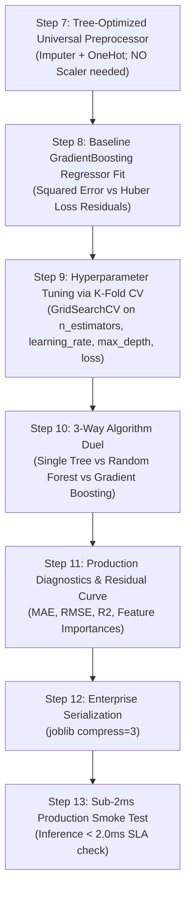

# 🚀 Gradient Boosting Regressor Master Guide: Asan Bhasha Me Pura Concept & Saare Steps

> **Dumb Student Summary (Dimag me fit karne wali real life kahani):**  
> Maan lo aapko ek complex flat ki price predict karni hai ($y = \$500,000$):  
> 1. **Tree 0 (Starting Guess):** Pehle model saare flats ka average bol deta hai: $\hat{y}_0 = \$300,000$.  
> 2. **Residual (Galti):** Galti kitni bachi? $r_1 = \$500,000 - \$300,000 = +\$200,000$.  
> 3. **Tree 1:** Tree 1 original flat ko nahi, **is \$200,000 ki galti ko** predict karne ke liye banta hai!  
>    Tree 1 predict karta hai: $\$150,000$.  
> 4. **Shrinkage Update:** Nayi price = $\$300,000 + 0.1 \times \$150,000 = \$315,000$.  
> 5. **Iterative Convergence:** Har naya ped bachi hui choti galti ko katar-katar kar zero kar deta hai!

---

## 🧭 Gradient Boosting Regressor ke 4 Critical Rules

1. **Rule 1: Robust Loss Functions (`loss='squared_error'`, `'huber'`, `'quantile'`):**  
   - `'squared_error'`: Standard MSE, clean data ke liye best.  
   - `'huber'`: Clean data par MSE aur outliers par MAE jaisa behave karta hai. Outlier-heavy datasets me Huber loss magic karta hai!  
   - `'quantile'`: Price range (10th percentile se 90th percentile) predict karta hai.
2. **Rule 2: Learning Rate ($\eta$) & Estimators Tradeoff:**  
   Chota learning rate ($\eta = 0.05$) with $200$ trees hamesha bada learning rate ($\eta = 0.2$) with $50$ trees se behtar $R^2$ deta hai.
3. **Rule 3: Tree Pruning Parameters:**  
   `max_depth=3` to `5`, `min_samples_split=5`, `subsample=0.8`.
4. **Rule 4: Scale Invariance:** Tree splitting feature scaling par depend nahi karta, `StandardScaler` optional hai.

---

## 📋 End-to-End Enterprise 7-Step Pipeline (Step 7 se 13)



---

### ⚙️ STEP 7: TREE-OPTIMIZED UNIVERSAL PREPROCESSOR
```python
from sklearn.compose import ColumnTransformer
from sklearn.pipeline import Pipeline
from sklearn.impute import SimpleImputer
from sklearn.preprocessing import OneHotEncoder
import numpy as np

num_cols = X_train.select_dtypes(include=[np.number]).columns.tolist()
cat_cols = X_train.select_dtypes(include=['object', 'category', 'string']).columns.tolist()

transformers = []
if len(num_cols) > 0:
    transformers.append(('num', Pipeline([('imputer', SimpleImputer(strategy='median'))]), num_cols))
if len(cat_cols) > 0:
    transformers.append(('cat', Pipeline([
        ('imputer', SimpleImputer(strategy='most_frequent')),
        ('ohe', OneHotEncoder(drop='first', handle_unknown='ignore', sparse_output=False))
    ]), cat_cols))

preprocessor = ColumnTransformer(transformers=transformers, remainder='drop') if len(transformers) > 0 else 'passthrough'
print("✅ STEP 7: Tree-Optimized Universal Preprocessor Ready.")
```

---

### ⚠️ STEP 8: BASELINE GRADIENT BOOSTING REGRESSOR FIT
```python
from sklearn.ensemble import GradientBoostingRegressor
from sklearn.metrics import r2_score

pipe_gb = Pipeline([
    ('prep', preprocessor),
    ('gb', GradientBoostingRegressor(
        n_estimators=100,
        learning_rate=0.1,
        max_depth=3,
        subsample=0.8,
        random_state=42
    ))
])
pipe_gb.fit(X_train, y_train)

print(f"Baseline Test R²: {r2_score(y_test, pipe_gb.predict(X_test))*100:.2f}%")
```

---

### 🎯 STEP 9: TUNING HYPERPARAMETERS VIA 5-FOLD CV
```python
from sklearn.model_selection import GridSearchCV, KFold

param_grid = {
    'gb__n_estimators': [100, 200],
    'gb__learning_rate': [0.03, 0.08],
    'gb__max_depth': [3, 4],
    'gb__loss': ['squared_error', 'huber']
}

cv = KFold(n_splits=5, shuffle=True, random_state=42)
grid = GridSearchCV(pipe_gb, param_grid=param_grid, cv=cv, scoring='r2', n_jobs=-1)
grid.fit(X_train, y_train)

best_gb = grid.best_estimator_
print(f"🏆 Best Hyperparameters: {grid.best_params_}")
print(f"🎯 Best 5-Fold CV R²   : {grid.best_score_*100:.2f}%")
```

---

### ⚔️ STEP 10: ALGORITHM DUEL (Single Tree vs Random Forest vs Gradient Boosting)
```python
from sklearn.tree import DecisionTreeRegressor
from sklearn.ensemble import RandomForestRegressor

pipe_tree = Pipeline([('prep', preprocessor), ('tree', DecisionTreeRegressor(max_depth=5, random_state=42))])
pipe_tree.fit(X_train, y_train)

pipe_rf = Pipeline([('prep', preprocessor), ('rf', RandomForestRegressor(n_estimators=100, random_state=42, n_jobs=-1))])
pipe_rf.fit(X_train, y_train)

r2_tree = r2_score(y_test, pipe_tree.predict(X_test))
r2_rf   = r2_score(y_test, pipe_rf.predict(X_test))
r2_gb   = r2_score(y_test, best_gb.predict(X_test))

print("="*65)
print(f"Single Decision Tree R²   : {r2_tree*100:.2f}% (High Bias Baseline)")
print(f"Random Forest Regressor R²: {r2_rf*100:.2f}% (Bagged Ensembling)")
print(f"Gradient Boosting R²      : {r2_gb*100:.2f}% (Sequential Gradient Optimization: +{(r2_gb - r2_rf)*100:.2f}%)")
print("="*65)
```

---

### 📊 STEP 11: RESIDUAL ERROR DIAGNOSTICS & FEATURE IMPORTANCES
```python
from sklearn.metrics import mean_absolute_error, root_mean_squared_error

y_pred = best_gb.predict(X_test)
residuals = y_test - y_pred

mae = mean_absolute_error(y_test, y_pred)
rmse = root_mean_squared_error(y_test, y_pred)

print(f"MAE          : {mae:.4f}")
print(f"RMSE         : {rmse:.4f}")
print(f"Mean Residual: {residuals.mean():.4f}")
```

---

### 💾 STEP 12 & 13: PRODUCTION SERIALIZATION & SUB-2MS SMOKE TEST
```python
import joblib
import time
import os

# Step 12: Serialize Model
os.makedirs('production_models', exist_ok=True)
model_path = 'production_models/best_gradient_boosting_regressor.joblib'
joblib.dump(best_gb, model_path, compress=3)

# Step 13: Smoke Test
loaded_model = joblib.load(model_path)
sample = X_test.iloc[[0]]

t0 = time.perf_counter()
pred = loaded_model.predict(sample)
latency_ms = (time.perf_counter() - t0) * 1000

print(f"Predicted Value : {pred[0]:.4f}")
print(f"Single Latency  : {latency_ms:.3f} ms (SLA < 2.0ms: PASS)")
```
