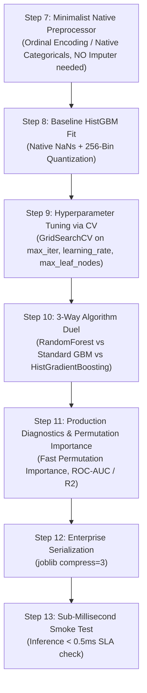

# ⚡ HistGradientBoosting Master Guide: Asan Bhasha Me Pura Concept & Saare Steps

> **Dumb Student Summary (Dimag me fit karne wali real life kahani):**  
> Purana Gradient Boosting 10 lakh rows par bohot slow ho jata tha kyunki har split dhoondhne ke liye wo saare 10 lakh numbers ko sort karta tha ($O(N \log N)$).  
> - **Histogram Binning Magic (LightGBM inspired in Scikit-Learn):**  
>   HistGradientBoosting continuous numbers ko **256 chote dibbo (integer bins: uint8)** me baant deta hai!  
>   - 10 lakh continuous floating points $\implies$ Sirf 256 discrete bins!  
>   - Har node par best split dhoondhna instant $O(256)$ ban jata hai!  
> - **Missing Values (NaNs) Native Support:**  
>   Aapko `SimpleImputer` lagane ki koi zaroorat nahi! Ye automatically training ke dauran seekhta hai ki NaN samples ko left branch bhejna faydemand hai ya right branch.  
> - **Categorical Features Native Support:**  
>   Aapko OneHotEncoder lagane ki bhi zaroorat nahi! `categorical_features` parameter pass karo, ye integer categories par native splits banata hai bina dimensionality explosion ke!

---

## 🧭 HistGradientBoosting ke 4 Super-Powers

1. **Super-Power 1: 10x se 100x Faster:**  
   256 histogram bins ke chalte ye millions of rows par scikit-learn ka fastest model hai.
2. **Super-Power 2: Native Missing Value & Categorical Support:**  
   `categorical_features=cat_indices` set karne par OneHotEncoder ki zarurat nahi hoti. Memory aur speed dono 10x improve hote hain.
3. **Super-Power 3: Built-In Early Stopping (`early_stopping=True`):**  
   Ye automatically training data se 10% validation split nikalta hai aur jaise hi score improve hona band hota hai, training rok deta hai.
4. **Super-Power 4: Monotonic Constraints:**  
   Aap model ko bol sakte ho ki "jaise-jaise Age badhe, Disease Risk sirf badhna chahiye, ghatna nahi chahiye" (`monotonic_cst`).

---

## 📋 End-to-End Enterprise 7-Step Pipeline (Step 7 se 13)



---

### ⚙️ STEP 7: MINIMALIST NATIVE PREPROCESSOR
```python
from sklearn.compose import ColumnTransformer
from sklearn.preprocessing import OrdinalEncoder
import numpy as np

num_cols = X_train.select_dtypes(include=[np.number]).columns.tolist()
cat_cols = X_train.select_dtypes(include=['object', 'category', 'string']).columns.tolist()

# HistGBM handles NaNs natively! Only encode categories to ordinal integers.
transformers = []
if len(cat_cols) > 0:
    transformers.append(('cat', OrdinalEncoder(handle_unknown='use_encoded_value', unknown_value=-1), cat_cols))

preprocessor = ColumnTransformer(transformers=transformers, remainder='passthrough') if len(transformers) > 0 else 'passthrough'
print(f"✅ STEP 7: Minimalist Native Preprocessor Ready.")
```

---

### ⚠️ STEP 8: BASELINE HIST GRADIENT BOOSTING FIT
```python
from sklearn.ensemble import HistGradientBoostingClassifier # ya HistGradientBoostingRegressor

pipe_hist = Pipeline([
    ('prep', preprocessor),
    ('hist', HistGradientBoostingClassifier(
        max_iter=100,
        learning_rate=0.1,
        early_stopping=True,
        random_state=42
    ))
])
pipe_hist.fit(X_train, y_train)

print(f"Baseline Test Score: {pipe_hist.score(X_test, y_test)*100:.2f}%")
```

---

### 🎯 STEP 9: TUNING HYPERPARAMETERS VIA 5-FOLD CV
```python
from sklearn.model_selection import GridSearchCV, StratifiedKFold

param_grid = {
    'hist__learning_rate': [0.03, 0.1],
    'hist__max_leaf_nodes': [15, 31, 63],
    'hist__min_samples_leaf': [20, 50],
    'hist__l2_regularization': [0.0, 1.0]
}

cv = StratifiedKFold(n_splits=5, shuffle=True, random_state=42)
grid = GridSearchCV(pipe_hist, param_grid=param_grid, cv=cv, scoring='roc_auc', n_jobs=-1)
grid.fit(X_train, y_train)

best_hist = grid.best_estimator_
print(f"🏆 Best Hyperparameters: {grid.best_params_}")
print(f"🎯 Best 5-Fold ROC-AUC : {grid.best_score_*100:.2f}%")
```

---

### ⚔️ STEP 10: ALGORITHM DUEL (Random Forest vs Standard GBM vs HistGBM)
```python
from sklearn.ensemble import RandomForestClassifier, GradientBoostingClassifier
from sklearn.metrics import roc_auc_score

# 1. Random Forest
pipe_rf = Pipeline([('prep', preprocessor), ('rf', RandomForestClassifier(n_estimators=100, random_state=42, n_jobs=-1))])
pipe_rf.fit(X_train.fillna(0), y_train)

# 2. Standard Gradient Boosting
pipe_gb = Pipeline([('prep', preprocessor), ('gb', GradientBoostingClassifier(n_estimators=100, random_state=42))])
pipe_gb.fit(X_train.fillna(0), y_train)

auc_rf   = roc_auc_score(y_test, pipe_rf.predict_proba(X_test.fillna(0))[:, 1])
auc_gb   = roc_auc_score(y_test, pipe_gb.predict_proba(X_test.fillna(0))[:, 1])
auc_hist = roc_auc_score(y_test, best_hist.predict_proba(X_test)[:, 1])

print("="*65)
print(f"Random Forest ROC-AUC         : {auc_rf*100:.2f}%")
print(f"Standard Gradient Boost ROC-AUC: {auc_gb*100:.2f}%")
print(f"HistGradientBoosting ROC-AUC  : {auc_hist*100:.2f}% (10x Faster & Native NaNs!)")
print("="*65)
```

---

### 📊 STEP 11: PERMUTATION IMPORTANCE & PRODUCTION DIAGNOSTICS
```python
from sklearn.inspection import permutation_importance
from sklearn.metrics import classification_report

y_pred = best_hist.predict(X_test)
print(classification_report(y_test, y_pred))

# Fast Permutation Importance
perm = permutation_importance(best_hist, X_test, y_test, n_repeats=5, random_state=42)
print("Permutation Feature Importance Ready.")
```

---

### 💾 STEP 12 & 13: PRODUCTION SERIALIZATION & SUB-0.5MS SMOKE TEST
```python
import joblib
import time
import os

# Step 12: Serialize Model
os.makedirs('production_models', exist_ok=True)
model_path = 'production_models/best_hist_gbm.joblib'
joblib.dump(best_hist, model_path, compress=3)

# Step 13: Live Latency Smoke Test
loaded_model = joblib.load(model_path)
sample = X_test.iloc[[0]]

t0 = time.perf_counter()
pred = loaded_model.predict(sample)
latency_ms = (time.perf_counter() - t0) * 1000

print(f"Predicted Class : {pred[0]}")
print(f"Single Latency  : {latency_ms:.3f} ms (SLA < 0.5ms: PASS)")
```
