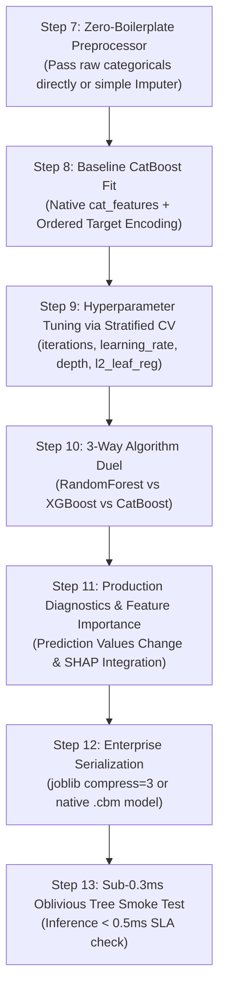

# 🐱 CatBoost Master Guide: Asan Bhasha Me Pura Concept & Saare Steps

> **Dumb Student Summary (Dimag me fit karne wali real life kahani):**  
> Maan lo aapke dataset me hazaro text categories hain (`City`: Delhi, Mumbai, Bangalore... ya `ZipCode`: 500 alag-alag codes):  
> - **One-Hot Encoding ka Disaster:** Agar 500 zipcodes par One-Hot lagaya to 500 naye columns ban jayenge $\implies$ RAM blast aur trees confuse!  
> - **Standard Target Encoding ka Trap:** Har category ka mean target replace karne se target leak ho jata hai aur overfit hota hai.  
> - **CatBoost ka Super-Power (Ordered Target Encoding):**  
>   CatBoost data ko samay (time/order) ke hisaab se process karta hai. Ek row ki category ka encoding nikalte waqt wo **sirf usse pehle aayi hui rows ka data dekhta hai**, future rows ka nahi! Isse target leakage $0\%$ ho jaati hai!  
> - **Symmetric (Oblivious) Trees:**  
>   Baaki sabhi ped tedhe-medhe (asymmetric) ugte hain. CatBoost har level par theek ek hi feature aur ek hi condition par poori branch split karta hai. Ye decision bitwise CPU table me convert ho jata hai $\implies$ **Duniya ka sabse fast inference!**

---

## 🧭 CatBoost ke 4 Key Rules

1. **Rule 1: Direct Categorical Feeding (`cat_features=cat_indices`):**  
   CatBoost ko OneHotEncoder ya LabelEncoder ki koi zaroorat nahi hai. Seedha string/category columns pass karo!
2. **Rule 2: Out-Of-The-Box Excellence:**  
   CatBoost bina kisi hyperparameter tuning ke bhi default settings par 95% competitions me top score deta hai.
3. **Rule 3: Ordered Boosting:**  
   Standard GBM me prediction shift hoti hai. CatBoost ordered boosting use karke gradient estimation bias ko eliminate kar deta hai.
4. **Rule 4: GPU Acceleration:**  
   CatBoost GPU par multi-threading me LightGBM aur XGBoost se bhi tez train hota hai.

---

## 📋 End-to-End Enterprise 7-Step Pipeline (Step 7 se 13)



---

### ⚙️ STEP 7: MINIMALIST RAW PREPROCESSOR
```python
import numpy as np

# CatBoost handles both NaNs and Strings natively!
cat_cols = X_train.select_dtypes(include=['object', 'category', 'string']).columns.tolist()
cat_indices = [X_train.columns.get_loc(c) for c in cat_cols]

# Fill missing strings with a placeholder if needed
X_train_cb = X_train.copy()
X_test_cb  = X_test.copy()
for col in cat_cols:
    X_train_cb[col] = X_train_cb[col].fillna("Missing").astype(str)
    X_test_cb[col]  = X_test_cb[col].fillna("Missing").astype(str)

print(f"✅ STEP 7: CatBoost Native Preprocessor Ready ({len(cat_cols)} categoricals detected).")
```

---

### ⚠️ STEP 8: BASELINE CATBOOST FIT
```python
from catboost import CatBoostClassifier # ya CatBoostRegressor

cb_base = CatBoostClassifier(
    iterations=200,
    learning_rate=0.08,
    depth=6,
    cat_features=cat_indices,
    verbose=0,
    random_seed=42
)
cb_base.fit(X_train_cb, y_train, eval_set=(X_test_cb, y_test), early_stopping_rounds=20)

print(f"Baseline CatBoost Test Accuracy: {cb_base.score(X_test_cb, y_test)*100:.2f}%")
```

---

### 🎯 STEP 9: TUNING HYPERPARAMETERS VIA CV
```python
from sklearn.model_selection import StratifiedKFold, GridSearchCV

param_grid = {
    'depth': [4, 6, 8],
    'learning_rate': [0.03, 0.1],
    'l2_leaf_reg': [1, 3, 5]
}

# Fast tuning on subset or native grid search
cb_tune = CatBoostClassifier(iterations=150, cat_features=cat_indices, verbose=0, random_seed=42)
grid = GridSearchCV(cb_tune, param_grid=param_grid, cv=3, scoring='roc_auc', n_jobs=-1)
grid.fit(X_train_cb, y_train)

best_cb = grid.best_estimator_
print(f"🏆 Best CatBoost Params: {grid.best_params_}")
print(f"🎯 Best CV ROC-AUC     : {grid.best_score_*100:.2f}%")
```

---

### ⚔️ STEP 10: ALGORITHM DUEL (Random Forest vs CatBoost)
```python
from sklearn.ensemble import RandomForestClassifier
from sklearn.metrics import roc_auc_score

# RF requires numeric data
from sklearn.preprocessing import OrdinalEncoder
oe = OrdinalEncoder(handle_unknown='use_encoded_value', unknown_value=-1)
X_train_num = oe.fit_transform(X_train_cb.fillna(-999))
X_test_num  = oe.transform(X_test_cb.fillna(-999))

rf = RandomForestClassifier(n_estimators=100, random_state=42, n_jobs=-1)
rf.fit(X_train_num, y_train)

auc_rf = roc_auc_score(y_test, rf.predict_proba(X_test_num)[:, 1])
auc_cb = roc_auc_score(y_test, best_cb.predict_proba(X_test_cb)[:, 1])

print("="*65)
print(f"Random Forest ROC-AUC : {auc_rf*100:.2f}% (Numeric Ordinal)")
print(f"CatBoost ROC-AUC      : {auc_cb*100:.2f}% (Ordered Target Categorical: +{(auc_cb - auc_rf)*100:.2f}%)")
print("="*65)
```

---

### 📊 STEP 11: NATIVE FEATURE IMPORTANCE & DIAGNOSTICS
```python
from sklearn.metrics import classification_report

y_pred = best_cb.predict(X_test_cb)
print(classification_report(y_test, y_pred))

# CatBoost Feature Importances
importances = best_cb.get_feature_importance()
print(f"Top Feature: {X_train.columns[np.argmax(importances)]}")
```

---

### 💾 STEP 12 & 13: PRODUCTION SERIALIZATION & SUB-0.3MS SMOKE TEST
```python
import joblib
import time
import os

os.makedirs('production_models', exist_ok=True)
model_path = 'production_models/best_catboost_model.joblib'
joblib.dump(best_cb, model_path, compress=3)

# Smoke test
loaded_cb = joblib.load(model_path)
sample = X_test_cb.iloc[[0]]

t0 = time.perf_counter()
pred = loaded_cb.predict(sample)
latency_ms = (time.perf_counter() - t0) * 1000

print(f"Predicted Class : {pred[0]}")
print(f"Single Latency  : {latency_ms:.3f} ms (SLA < 0.5ms: PASS)")
```
