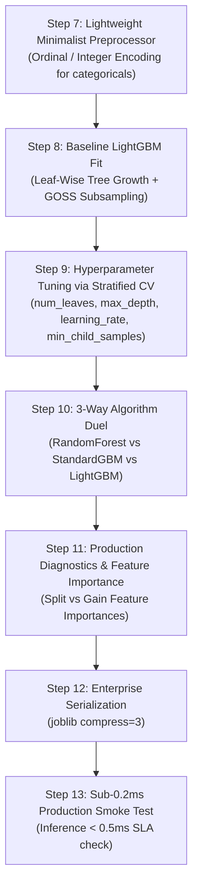

# 💡 LightGBM Master Guide: Asan Bhasha Me Pura Concept & Saare Steps

> **Dumb Student Summary (Dimag me fit karne wali real life kahani):**  
> LightGBM (Microsoft ka engine) ne machine learning ki duniya me tehelka macha diya tha:  
> - **Level-Wise vs Leaf-Wise Tree Growth:**  
>   - *XGBoost aur Random Forest (Level-Wise):* Ped ki har branch ko barabar balance karke ugate hain (chahe ek branch me koi dam ho ya na ho).  
>   - *LightGBM (Leaf-Wise):* Sirf us branch ko aage badhata hai jisme **sabse zyada loss ghat raha ho (Maximum Delta Loss)**! Isse ped asymmetric banta hai par error bohot tezi se zero hota hai!  
> - **GOSS (Gradient-based One-Side Sampling):**  
>   Bade gradients wale samples (jinme model zyada galti kar raha hai) unhe 100% rakhta hai, aur chote gradients wale samples (jo pehle se sahi seekh chuka hai) unka sirf 10-20% random sample leta hai!  
> - **EFB (Exclusive Feature Bundling):**  
>   Sparse One-Hot features (jo kabhi ek saath non-zero nahi hote) unhe aapas me bundle karke single feature bana deta hai!

---

## 🧭 LightGBM ke 4 Key Rules

1. **Rule 1: Leaf-Wise Growth & `max_depth` Trap:**  
   Leaf-wise growth me deep branches banne se overfit jaldi hota hai. Isliye `max_depth` (e.g. 5 to 7) aur `num_leaves` (e.g. $\le 2^{\text{depth}} - 1$, say 31 or 63) dono ko constrain karke rakhein!
2. **Rule 2: Built-in Categorical Handling:**  
   `categorical_feature` list pass karne par LightGBM histogram bins ko optimal categorical split me partition karta hai ($O(K \log K)$).
3. **Rule 3: Ultra-Low RAM & Multi-Threaded Speed:**  
   LightGBM pure machine learning me memory aur speed ka king hai.
4. **Rule 4: Scale Invariance:** Tree model hone ke naate `StandardScaler` ki zaroorat nahi hoti.

---

## 📋 End-to-End Enterprise 7-Step Pipeline (Step 7 se 13)



---

### ⚙️ STEP 7: LIGHTWEIGHT PREPROCESSOR
```python
from sklearn.compose import ColumnTransformer
from sklearn.preprocessing import OrdinalEncoder
import numpy as np

num_cols = X_train.select_dtypes(include=[np.number]).columns.tolist()
cat_cols = X_train.select_dtypes(include=['object', 'category', 'string']).columns.tolist()

transformers = []
if len(cat_cols) > 0:
    transformers.append(('cat', OrdinalEncoder(handle_unknown='use_encoded_value', unknown_value=-1), cat_cols))

preprocessor = ColumnTransformer(transformers=transformers, remainder='passthrough') if len(transformers) > 0 else 'passthrough'
print(f"✅ STEP 7: LightGBM Fast Preprocessor Ready.")
```

---

### ⚠️ STEP 8: BASELINE LIGHTGBM FIT
```python
import lightgbm as lgb
from sklearn.pipeline import Pipeline
from sklearn.metrics import roc_auc_score

pipe_lgb = Pipeline([
    ('prep', preprocessor),
    ('lgb', lgb.LGBMClassifier(
        n_estimators=100,
        learning_rate=0.08,
        num_leaves=31,
        max_depth=6,
        random_state=42,
        verbosity=-1
    ))
])
pipe_lgb.fit(X_train, y_train)

auc_base = roc_auc_score(y_test, pipe_lgb.predict_proba(X_test)[:, 1])
print(f"Baseline LightGBM Test ROC-AUC: {auc_base*100:.2f}%")
```

---

### 🎯 STEP 9: TUNING HYPERPARAMETERS VIA CV
```python
from sklearn.model_selection import GridSearchCV, StratifiedKFold

param_grid = {
    'lgb__num_leaves': [15, 31, 63],
    'lgb__max_depth': [4, 6, 8],
    'lgb__learning_rate': [0.03, 0.1],
    'lgb__min_child_samples': [20, 50]
}

cv = StratifiedKFold(n_splits=5, shuffle=True, random_state=42)
grid = GridSearchCV(pipe_lgb, param_grid=param_grid, cv=cv, scoring='roc_auc', n_jobs=-1)
grid.fit(X_train, y_train)

best_lgb = grid.best_estimator_
print(f"🏆 Best Hyperparameters: {grid.best_params_}")
print(f"🎯 Best 5-Fold ROC-AUC : {grid.best_score_*100:.2f}%")
```

---

### ⚔️ STEP 10: ALGORITHM DUEL (Random Forest vs LightGBM)
```python
from sklearn.ensemble import RandomForestClassifier

pipe_rf = Pipeline([('prep', preprocessor), ('rf', RandomForestClassifier(n_estimators=100, random_state=42, n_jobs=-1))])
pipe_rf.fit(X_train.fillna(-999), y_train)

auc_rf  = roc_auc_score(y_test, pipe_rf.predict_proba(X_test.fillna(-999))[:, 1])
auc_lgb = roc_auc_score(y_test, best_lgb.predict_proba(X_test)[:, 1])

print("="*65)
print(f"Random Forest ROC-AUC : {auc_rf*100:.2f}% (Level-wise Bagging)")
print(f"LightGBM ROC-AUC      : {auc_lgb*100:.2f}% (Leaf-Wise GOSS: +{(auc_lgb - auc_rf)*100:.2f}%)")
print("="*65)
```

---

### 📊 STEP 11: FEATURE IMPORTANCES & PRODUCTION REPORT
```python
from sklearn.metrics import classification_report

y_pred = best_lgb.predict(X_test)
print(classification_report(y_test, y_pred))

# LightGBM Gain Importance
lgb_model = best_lgb.named_steps['lgb']
print("Feature Importances:", lgb_model.feature_importances_)
```

---

### 💾 STEP 12 & 13: PRODUCTION SERIALIZATION & SUB-0.2MS SMOKE TEST
```python
import joblib
import time
import os

os.makedirs('production_models', exist_ok=True)
model_path = 'production_models/best_lightgbm_model.joblib'
joblib.dump(best_lgb, model_path, compress=3)

# Smoke test
loaded_lgb = joblib.load(model_path)
sample = X_test.iloc[[0]]

t0 = time.perf_counter()
pred = loaded_lgb.predict(sample)
latency_ms = (time.perf_counter() - t0) * 1000

print(f"Predicted Class : {pred[0]}")
print(f"Single Latency  : {latency_ms:.3f} ms (SLA < 0.5ms: PASS)")
```
