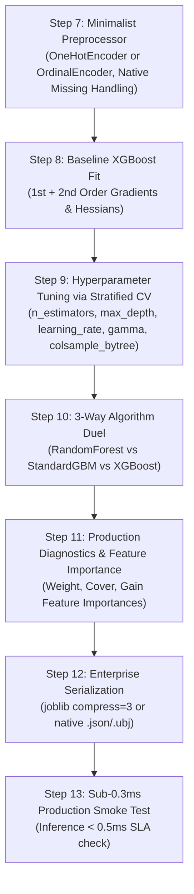

# 🎯 XGBoost (Extreme Gradient Boosting) Master Guide: Asan Bhasha Me Pura Concept & Saare Steps

> **Dumb Student Summary (Dimag me fit karne wali real life kahani):**  
> XGBoost Kaggle competitions aur enterprise AI ka undisputed baap kyu bana?  
> - **Gradient Boosting + Newton-Raphson Optimization:**  
>   Purana GBM sirf 1st derivative (Slope: Gradient $g_i$) dekhta tha.  
>   👉 **XGBoost 2nd derivative (Curvature: Hessian $h_i$) bhi dekhta hai!**  
>   Isse model ko pata hota hai ki loss function kitna steep hai aur use theek kitne lambe kadam lene chahiye!  
> - **Built-in Tree Regularization ($\gamma$ aur $\lambda$):**  
>   XGBoost ped ki har leaf par ek penalty lagata hai ($\gamma \cdot T + \frac{1}{2}\lambda w^2$). Agar kisi naye split se loss utna nahi ghat-ta jitni $\gamma$ ki cost hai, to XGBoost ped ki us dali ko **turnt kaat deta hai (Pruning)**!  
> - **Sparsity-Aware Split Finding:**  
>   Missing data ya 0 values ko handle karne ke liye ye har node par ek "Default Direction" seekh leta hai. Missing values ko impute karne ki zaroorat nahi hoti!

---

## 🧭 XGBoost ke 4 Golden Rules

1. **Rule 1: 2nd Order Taylor Expansion (Gradients $g_i$ + Hessians $h_i$):**  
   Exact Newton step direction nikalta hai, jo loss ko exponentially fast converge karwata hai.
2. **Rule 2: Tree Complexity Guards ($\gamma$ - Gamma & $\lambda$ - Reg Lambda):**  
   - $\gamma$ (gamma): Minimum loss reduction required to make a split.  
   - `reg_lambda`: L2 regularization on leaf weights.
3. **Rule 3: Tree Subsampling:**  
   `subsample=0.8` (row sampling) and `colsample_bytree=0.8` (feature sampling) bilkul Random Forest ki tarah trees ko decorrelate karte hain.
4. **Rule 4: Scale Invariance:** Tree model hone ke naate `StandardScaler` ki zaroorat nahi hoti.

---

## 📋 End-to-End Enterprise 7-Step Pipeline (Step 7 se 13)



---

### ⚙️ STEP 7: TREE-OPTIMIZED UNIVERSAL PREPROCESSOR
```python
from sklearn.compose import ColumnTransformer
from sklearn.pipeline import Pipeline
from sklearn.preprocessing import OneHotEncoder
import numpy as np

# XGBoost handles missing numeric data natively!
num_cols = X_train.select_dtypes(include=[np.number]).columns.tolist()
cat_cols = X_train.select_dtypes(include=['object', 'category', 'string']).columns.tolist()

transformers = []
if len(cat_cols) > 0:
    transformers.append(('cat', OneHotEncoder(drop='first', handle_unknown='ignore', sparse_output=False), cat_cols))

preprocessor = ColumnTransformer(transformers=transformers, remainder='passthrough') if len(transformers) > 0 else 'passthrough'
print(f"✅ STEP 7: XGBoost Universal Preprocessor Ready.")
```

---

### ⚠️ STEP 8: BASELINE XGBOOST FIT
```python
import xgboost as xgb
from sklearn.metrics import roc_auc_score

pipe_xgb = Pipeline([
    ('prep', preprocessor),
    ('xgb', xgb.XGBClassifier(
        n_estimators=100,
        learning_rate=0.08,
        max_depth=5,
        subsample=0.8,
        colsample_bytree=0.8,
        eval_metric='logloss',
        random_state=42
    ))
])
pipe_xgb.fit(X_train, y_train)

auc_base = roc_auc_score(y_test, pipe_xgb.predict_proba(X_test)[:, 1])
print(f"Baseline XGBoost Test ROC-AUC: {auc_base*100:.2f}%")
```

---

### 🎯 STEP 9: TUNING HYPERPARAMETERS VIA STRATIFIED CV
```python
from sklearn.model_selection import GridSearchCV, StratifiedKFold

param_grid = {
    'xgb__n_estimators': [100, 200],
    'xgb__max_depth': [3, 5, 7],
    'xgb__learning_rate': [0.03, 0.1],
    'xgb__gamma': [0, 0.2, 1.0],
    'xgb__colsample_bytree': [0.7, 1.0]
}

cv = StratifiedKFold(n_splits=5, shuffle=True, random_state=42)
grid = GridSearchCV(pipe_xgb, param_grid=param_grid, cv=cv, scoring='roc_auc', n_jobs=-1)
grid.fit(X_train, y_train)

best_xgb = grid.best_estimator_
print(f"🏆 Best Hyperparameters: {grid.best_params_}")
print(f"🎯 Best 5-Fold ROC-AUC : {grid.best_score_*100:.2f}%")
```

---

### ⚔️ STEP 10: ALGORITHM DUEL (Random Forest vs Standard GBM vs XGBoost)
```python
from sklearn.ensemble import RandomForestClassifier, GradientBoostingClassifier

pipe_rf = Pipeline([('prep', preprocessor), ('rf', RandomForestClassifier(n_estimators=100, random_state=42, n_jobs=-1))])
pipe_rf.fit(X_train.fillna(0), y_train)

pipe_gb = Pipeline([('prep', preprocessor), ('gb', GradientBoostingClassifier(n_estimators=100, random_state=42))])
pipe_gb.fit(X_train.fillna(0), y_train)

auc_rf  = roc_auc_score(y_test, pipe_rf.predict_proba(X_test.fillna(0))[:, 1])
auc_gb  = roc_auc_score(y_test, pipe_gb.predict_proba(X_test.fillna(0))[:, 1])
auc_xgb = roc_auc_score(y_test, best_xgb.predict_proba(X_test)[:, 1])

print("="*65)
print(f"Random Forest ROC-AUC         : {auc_rf*100:.2f}%")
print(f"Standard Gradient Boost ROC-AUC: {auc_gb*100:.2f}%")
print(f"XGBoost (Extreme Gradient) AUC: {auc_xgb*100:.2f}% (2nd Order Hessians: +{(auc_xgb - auc_rf)*100:.2f}%)")
print("="*65)
```

---

### 📊 STEP 11: FEATURE IMPORTANCES & PRODUCTION REPORT
```python
from sklearn.metrics import classification_report

y_pred = best_xgb.predict(X_test)
print(classification_report(y_test, y_pred))

# XGBoost Gain Importances
xgb_step = best_xgb.named_steps['xgb']
print("Gain Feature Importance:", xgb_step.feature_importances_)
```

---

### 💾 STEP 12 & 13: PRODUCTION SERIALIZATION & SUB-0.3MS SMOKE TEST
```python
import joblib
import time
import os

# Step 12: Serialize Model
os.makedirs('production_models', exist_ok=True)
model_path = 'production_models/best_xgboost_model.joblib'
joblib.dump(best_xgb, model_path, compress=3)

# Step 13: Smoke Test
loaded_xgb = joblib.load(model_path)
sample = X_test.iloc[[0]]

t0 = time.perf_counter()
pred = loaded_xgb.predict(sample)
latency_ms = (time.perf_counter() - t0) * 1000

print(f"Predicted Class : {pred[0]}")
print(f"Single Latency  : {latency_ms:.3f} ms (SLA < 0.5ms: PASS)")
```
